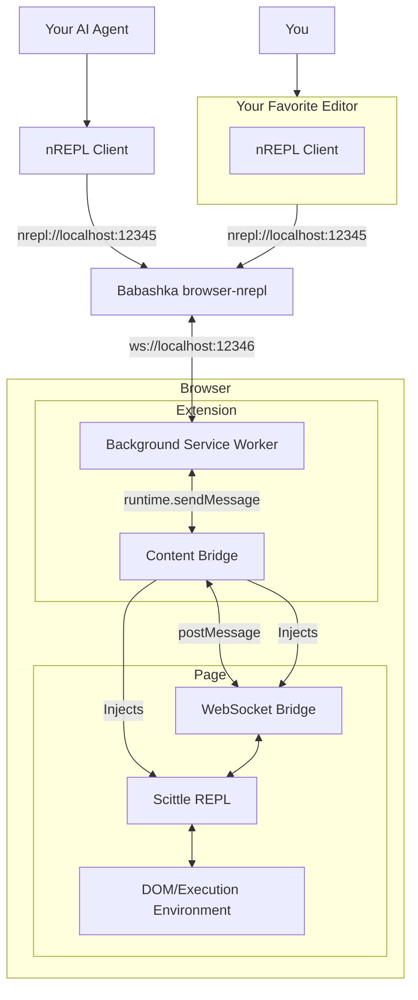

# Scittle Tamper

A web browser extension that lets you write userscripts using Clojure. It works by injecting [Scittle](https://github.com/babashka/scittle) into the page. You can also use the Scittle REPL server to interactively edit your userscripts, or just hack the current page, using your favorite Clojure editor. Or let your AI agent loose on the page.

## Userscripts Usage

> [!NOTE]
> Currently super **experimental**. I am fumbling quite a bit over the UI/Ux and APIs.

There is a script “editor” (a textarea) in the

## REPL Usage

### Prerequisites

1. [Babashka](https://babashka.org)
2. A REPL client (such as a Clojure editor, like [Calva](https://calva.io))

On the web page where you want to jack-in your REPL client: open the **Scittle Tamper** extension
and follow the 1-2-3 step instructions.

Step **1** let's you copy a Babashka command line that starts the browser-nrepl server, which is sort of a relay between your editor and the browser page.

> [!NOTE]
> The extension does not tamper with the web pages until you connect the REPL. Once that is done the you evaluate code in the page context. It's similar to using the console in the development tools, but you do it from your editor, and instead of JavaScript you use ClojureScript.

### Demo

* https://www.youtube.com/watch?v=aJ06tdIjdy0

### How it Works

You connect to the browser's page execution environment using an nREPL client in your editor. The nREPL client is in turn connected to the Babashka **browser-nrepl** server which bridges nREPL (port 12345) to WebSocket (port 12346). This WebSocket port is what the browser extension connects to.

The extension uses a background service worker to handle WebSocket connections, which bypasses strict Content Security Policies (like GitHub's) that would otherwise block connections to localhost. Messages are relayed through the content bridge to the page's WebSocket bridge, which provides a virtual WebSocket interface for the Scittle REPL.

### Installing

Available on the Chrome Web Store: https://chromewebstore.google.com/detail/bfcbpnmgefiblppimmoncoflmcejdbei

Firefox pending review, but you can install the package manually in the browser's developer mode. Grab the extension zip file(s) from the latest [release](https://github.com/PEZ/browser-jack-in/releases).

I'm still pondering if I should submit to Safari App Store or not. Apple doesn't exactly love developers...

**Firefox:**

1. Go to `about:debugging#/runtime/this-firefox`
2. Click "Load Temporary Add-on"
3. Select any file in `scittle-tamper-firefox.zip` file

**Safari:**

1. Go to **Settings** -> **Developer**
2. **Add Temporary Extension...**

**Chrome:**

0. Unpack `scittle-tamper-chrome.zip` (will unpack a `chrome` folder)
1. Go to `chrome://extensions`
2. Enable "Developer mode"
3. Click "Load unpacked"
4. Select the `chrome` folder

## Privacy

The extension does not collect any data whatsoever, and never will.

## Licence

[MIT](LICENSE)

## Development

To build and hack on the extension, see the [development docs](docs/dev.md).

## Enjoy! ♥️

Please consider [sponsoring my open source work](https://github.com/sponsors/PEZ).
