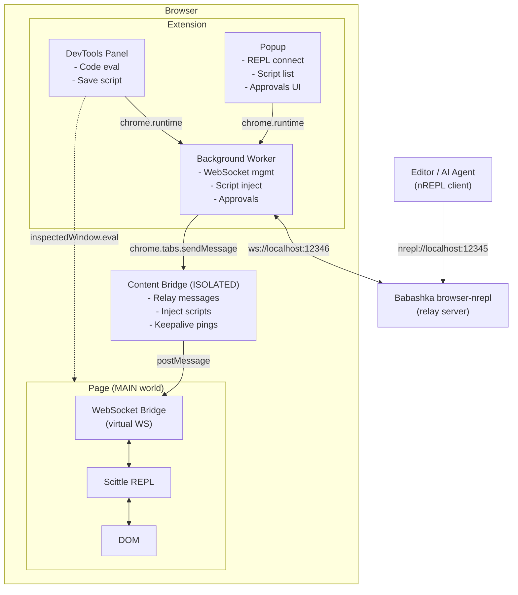

# Epupp Architecture Overview

Epupp bridges your Clojure editor to the browser's page execution environment through a multi-layer message relay system.

The architecture handles four main use cases:

1. **REPL Connection** - Live code evaluation from editor via nREPL
2. **Userscript Auto-Injection** - Saved scripts execute on matching URLs
3. **DevTools Panel Evaluation** - Direct evaluation from the panel UI
4. **REPL FS Sync** - File operations over the REPL for userscript management

Detailed docs live under [architecture/](architecture/). Use the Navigate table below to jump to the relevant reference.

## Component Architecture

**Note:** Panel evaluates code directly in page context via `chrome.devtools.inspectedWindow.eval` (dotted line), but requests Scittle injection via background worker.

## Navigate

| Topic | Read This |
|------|-----------|
| **UI architecture + TDD workflow** | [ui.md](ui.md) |
| Source file map + dependencies | [architecture/components.md](architecture/components.md) |
| Message types + payloads | [architecture/message-protocol.md](architecture/message-protocol.md) |
| REPL FS Sync architecture | [architecture/repl-fs-sync.md](architecture/repl-fs-sync.md) |
| Connected REPL flow + `epupp/manifest!` | [architecture/connected-repl.md](architecture/connected-repl.md) |
| State atoms + action/effect tables | [architecture/state-management.md](architecture/state-management.md) |
| Uniflow event system | [architecture/uniflow.md](architecture/uniflow.md) |
| REPL/userscripts/panel injection flows | [architecture/injection-flows.md](architecture/injection-flows.md) |
| Trust boundaries + CSP strategy | [architecture/security.md](architecture/security.md) |
| Build pipeline + configuration injection | [architecture/build-pipeline.md](architecture/build-pipeline.md) |
| CSS architecture + design tokens | [architecture/css-architecture.md](architecture/css-architecture.md) |

## Related

- Userscript design decisions: [userscripts-architecture.md](userscripts-architecture.md)
- Development workflow and build commands: [dev.md](dev.md)
