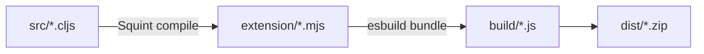

# Epupp Build Pipeline



Use `bb squint-compile` for a direct compilation pass (it forwards arguments to Squint).

## Build-Time Configuration

Configuration is injected at bundle time via esbuild, not through a source file:

1. **Config files**: `config/dev.edn`, `config/prod.edn`, and `config/test.edn` contain build settings
2. **Build script**: `tasks.clj` reads the appropriate config based on mode
3. **Injection**: esbuild's `--define:EXTENSION_CONFIG=...` injects config as a global to all bundles
4. **Access**: All extension modules access it via `js/EXTENSION_CONFIG`

Config shape:

```clojure
{:dev true/false
 :test true/false   ; enables test instrumentation
 :depsString "{:deps {...}}"} ; bb -Sdeps string for browser-nrepl
```

See [../dev.md](../dev.md) for build commands.
