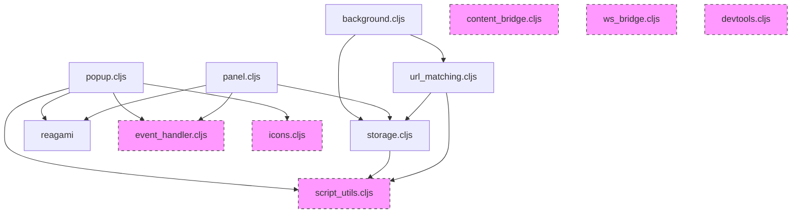

# Epupp Components and Source Files

This document is a map of where the architecture lives in code.

## Source Files

| File | Context | Purpose |
|------|---------|---------|
| `background.cljs` | Service Worker | WebSocket management, script injection orchestration, approval handling |
| `registration.cljs` | Service Worker | Content script registration for early-timing scripts |
| `content_bridge.cljs` | Content Script (ISOLATED) | Message relay, DOM injection, keepalive |
| `userscript-loader.js` | Content Script (ISOLATED) | Early script injection at document-start |
| `ws_bridge.cljs` | Page Script (MAIN) | Virtual WebSocket for Scittle REPL |
| `popup.cljs` | Extension Popup | REPL connection UI, script management |
| `panel.cljs` | DevTools Panel | Code evaluation, script editing |
| `devtools.cljs` | DevTools Entry | Registers the panel |
| `storage.cljs` | Shared | Script CRUD, chrome.storage.local |
| `url_matching.cljs` | Shared | URL pattern matching with storage |
| `script_utils.cljs` | Shared | Pure utilities for script data and URL pattern matching |
| `manifest_parser.cljs` | Shared | Parse `:epupp/run-at` and other annotations from code |
| `event_handler.cljs` | Shared | Uniflow event system |
| `icons.cljs` | Shared | SVG icon components |
| `view_elements.cljs` | Shared | Shared Hiccup components (buttons, status, empty states) |

## Styling

For CSS architecture, design tokens, and component styling, see [css-architecture.md](css-architecture.md).

## Naming Conventions

- Files use underscores: `content_bridge.cljs`
- Namespaces use hyphens: `(ns content-bridge ...)`

## Module Dependencies

**Standalone modules** (dashed): No internal dependencies, can be used independently.
