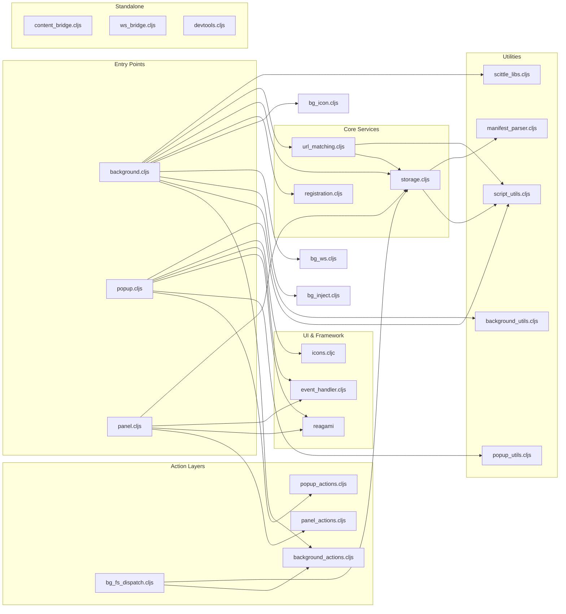

# Epupp Components and Source Files

This document is a map of where the architecture lives in code.

## Source Files

| File | Context | Purpose |
|------|---------|---------|
| `background.cljs` | Service Worker | WebSocket management, script injection orchestration, icon state |
| `background_actions.cljs` | Service Worker | Pure background action router (WS, icon, history, FS) |
| `background_actions/*.cljs` | Service Worker | Pure handlers for history, icon state, WS, REPL FS |
| `background_utils.cljs` | Shared | Background helper functions (icon, connections, `should-scan-for-installer?`, origin whitelist) |
| `bg_fs_dispatch.cljs` | Service Worker | FS Uniflow dispatcher and effect bridge |
| `bg_inject.cljs` | Service Worker | Script injection orchestration (bridge, Scittle, userscripts), conditional installer injection (`execute-in-isolated`, `scan-for-userscripts-fn`, `inject-installer!`) |
| `bg_ws.cljs` | Service Worker | WebSocket lifecycle management per tab |
| `bg_icon.cljs` | Service Worker | Extension icon state management |
| `registration.cljs` | Service Worker | Content script registration for early-timing scripts |
| `content_bridge.cljs` | Content Script (ISOLATED) | Message relay, DOM injection, keepalive, FS forwarder |
| `userscript-loader.js` | Content Script (ISOLATED) | Early script injection at document-start/end |
| `trigger-scittle.js` | Page Script (MAIN) | Triggers Scittle to evaluate injected tags |
| `ws_bridge.cljs` | Page Script (MAIN) | Virtual WebSocket for Scittle REPL |
| `popup.cljs` | Extension Popup | REPL connection UI, script management, settings |
| `popup_actions.cljs` | Extension Popup | Pure popup actions for Uniflow |
| `popup_utils.cljs` | Shared | Popup-specific pure helpers |
| `panel.cljs` | DevTools Panel | Code evaluation, script editing |
| `panel_actions.cljs` | DevTools Panel | Pure panel actions for Uniflow |
| `devtools.cljs` | DevTools Entry | Registers the panel |
| `storage.cljs` | Shared | Script CRUD, chrome.storage.local |
| `url_matching.cljs` | Shared | URL pattern matching with storage |
| `script_utils.cljs` | Shared | Pure utilities for script data and URL pattern matching |
| `manifest_parser.cljs` | Shared | Parse manifest maps from code (`:epupp/*`) |
| `scittle_libs.cljs` | Shared | Resolve Scittle library URLs and dependency lists |
| `event_handler.cljs` | Shared | Uniflow event system |
| `icons.cljc` | Shared | SVG icon components |
| `view_elements.cljs` | Shared | Shared Hiccup components (buttons, status, empty states, sponsor heart) |
| `test_logger.cljs` | Shared | Test instrumentation and error capture |

### Builtin Userscripts

| File | Purpose |
|------|---------|
| `extension/userscripts/epupp/sponsor.cljs` | Sponsor detection on GitHub Sponsors page ([details](sponsor-heart.md)) |

## Styling

For CSS architecture, design tokens, and component styling, see [css-architecture.md](css-architecture.md).

## Naming Conventions

- Files use underscores: `content_bridge.cljs`
- Namespaces use hyphens: `(ns content-bridge ...)`

## Module Dependencies

