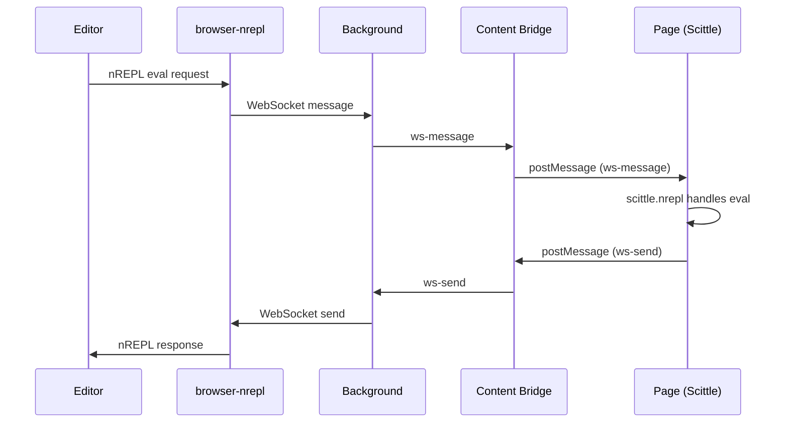
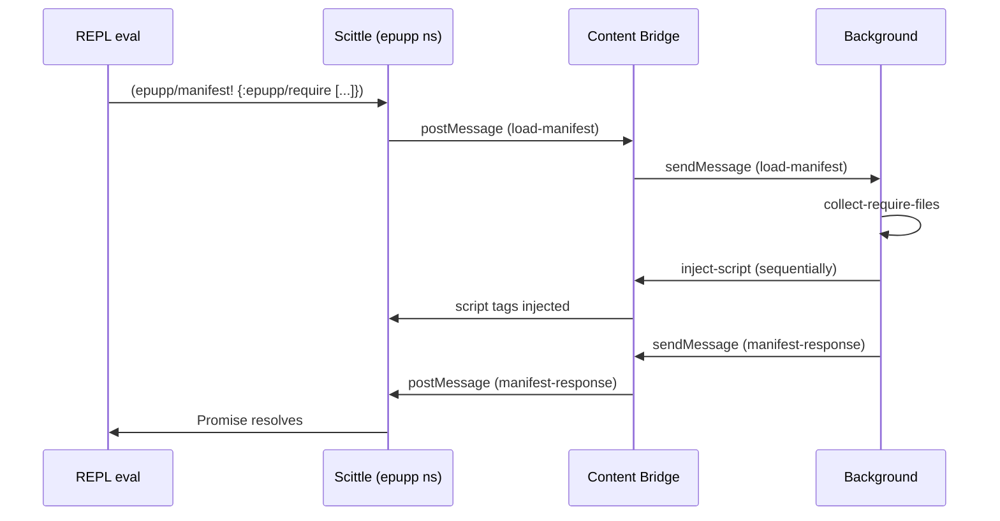

# Connected REPL Architecture

This document describes how Epupp bridges your Clojure editor to the browser's page execution environment via nREPL.

## Overview

The connected REPL enables live ClojureScript evaluation in web pages from any nREPL client (Calva, CIDER, etc.). Code flows through a multi-hop relay:

```
Editor (nREPL client)
    ↓ nREPL protocol
Babashka browser-nrepl (relay server)
    ↓ WebSocket
Extension Background Worker
    ↓ chrome.tabs.sendMessage
Content Bridge (ISOLATED world)
    ↓ window.postMessage
WebSocket Bridge (MAIN world)
    ↓ intercepted WebSocket
Scittle nREPL (page context)
    ↓ eval
DOM / Page APIs
```

## Connection Flow

When the user clicks "Connect" in the popup:

1. **Popup** sends `connect-tab` message to background with `tabId` and `wsPort`
2. **Background** orchestrates via `connect-tab!`:
   - Execute `check-status-fn` to assess current page state
   - Inject `content-bridge.js` (ISOLATED world) if missing
   - Inject `ws-bridge.js` (MAIN world) if missing
   - Wait for bridge ready (ping/pong handshake)
   - Ensure Scittle is loaded (`vendor/scittle.js`)
   - Set `SCITTLE_NREPL_WEBSOCKET_PORT` global
   - Inject `vendor/scittle.nrepl.js` (auto-connects to relay)
   - Poll until WebSocket reaches OPEN state
   - **Inject Epupp API** (`bundled/epupp/*.cljs` via fetch+inject)
3. **WebSocket Bridge** intercepts `new WebSocket('ws://localhost:PORT/_nrepl')`
4. Messages flow bidirectionally through the relay chain

## Message Flow: Evaluation



## The `epupp` Namespace

At connect time, Epupp injects its API namespaces from bundled Scittle source files:

| File | Namespace | Purpose |
|------|-----------|--------|
| `bundled/epupp/repl.cljs` | `epupp.repl` | REPL utilities including `manifest!` for library loading |
| `bundled/epupp/fs.cljs` | `epupp.fs` | File system operations: `cat`, `ls`, `save!`, `mv!`, `rm!` |

The injection uses the same pattern as userscripts: background fetches file content via `chrome.runtime.getURL`, sends it to the content bridge via `inject-userscript` message (creating inline `<script type="application/x-scittle">` tags), and triggers Scittle evaluation.

This enables loading Scittle ecosystem libraries on demand from the REPL:

```clojure
;; Load Replicant for reactive UI
(epupp/manifest! {:epupp/require ["scittle://replicant.js"]})

;; Now use it
(require '[replicant.dom :as r])
(r/render (js/document.getElementById "app")
  [:h1 "Hello from REPL!"])
```

### Library Loading Flow



### Idempotency

Library injection is idempotent - calling `manifest!` multiple times with the same libraries does not create duplicate script tags. The content bridge tracks injected URLs via `window.__epuppInjectedScripts`.

## WebSocket Bridge

The `ws-bridge.js` script intercepts WebSocket connections to `/_nrepl` URLs and routes them through the extension's message passing system instead of actual network connections.

This allows Scittle's nREPL client to "connect" to the relay server even though:
- The page may have CSP restrictions blocking WebSocket connections
- The extension can manage the actual WebSocket in the background worker

## Auto-Connect

When enabled, Epupp automatically connects the REPL on navigation:
1. `webNavigation.onCompleted` fires
2. Background checks auto-connect settings
3. If enabled and relay server is reachable, triggers `connect-tab!`

## Connection Tracking

The background worker tracks active connections in state:

```clojure
{:ws/connections {tab-id {:ws WebSocket
                          :port port-number
                          :title "Page Title"
                          :url "https://..."}}}
```

The popup queries this via `get-connections` message to display connection status.

## Related Documentation

- [injection-flows.md](injection-flows.md) - Injection orchestration details
- [message-protocol.md](message-protocol.md) - Message type reference
- [../userscripts-architecture.md](../userscripts-architecture.md) - Userscript injection (separate from REPL)
