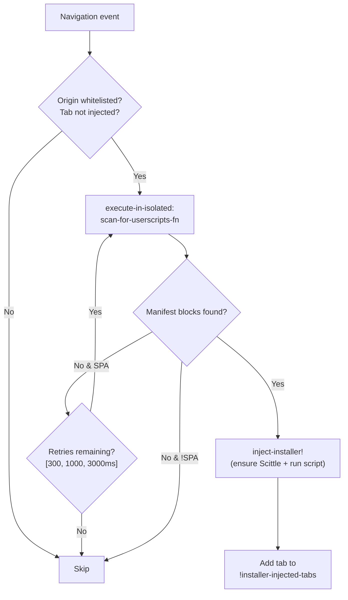
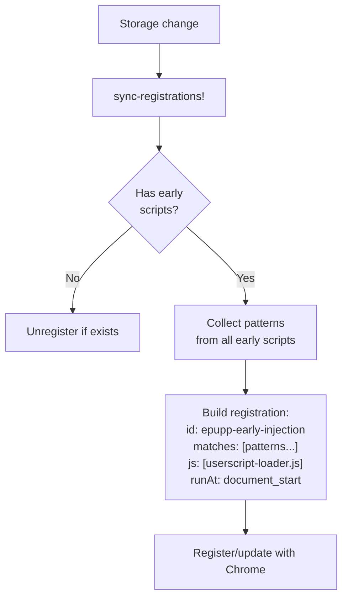
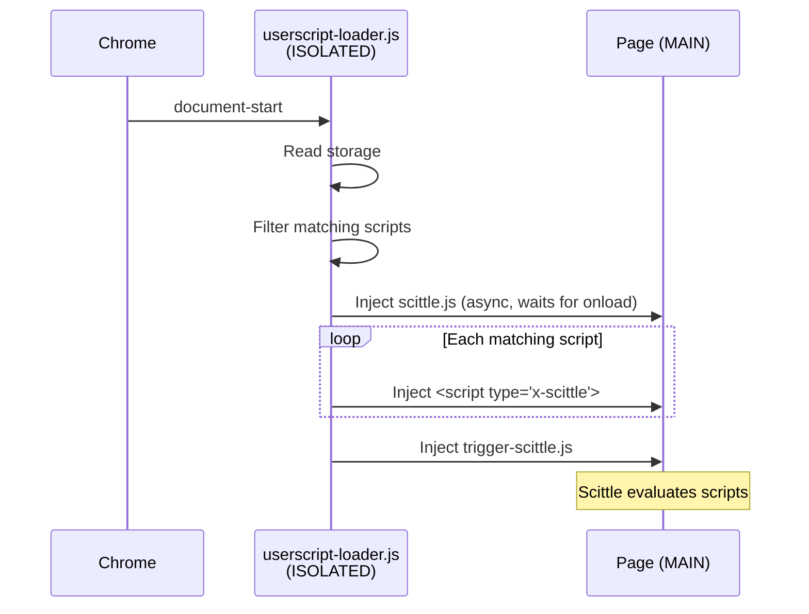

# Epupp Injection Flows

This document describes how code gets injected and evaluated across the three main workflows.

## Injection Flows

### REPL Connection (from Popup)

See [connected-repl.md](connected-repl.md) for full details including message flow diagrams.

1. User clicks "Connect" in popup
2. Popup sends `connect-tab` message to background worker with `tabId` and `wsPort`
3. Background's `connect-tab!` orchestrates the connection:
   - Execute `check-status-fn` in page context
   - If no bridge: inject `content-bridge.js` (ISOLATED world)
   - Inject `ws-bridge.js` (MAIN world) if needed
   - Wait for bridge ready (ping/pong)
   - Ensure Scittle is loaded
    - Set `SCITTLE_NREPL_WEBSOCKET_PORT` global
    - Inject `vendor/scittle.nrepl.js` or reconnect existing client
    - Poll until WebSocket reaches OPEN state
    - **Inject Epupp API files** (`bundled/epupp/*.cljs` - provides `epupp.repl/manifest!` and `epupp.fs/*`)
4. `ws-bridge` intercepts WebSocket for `/_nrepl` URLs
5. Messages flow: Page ↔ Content Bridge ↔ Background ↔ Babashka relay

### Userscript Auto-Injection (on Navigation)

1. `webNavigation.onCompleted` fires (main frame only)
2. `handle-navigation!` waits for storage initialization
3. `process-navigation!` gets matching enabled scripts
4. Filters to `document-idle` scripts only
5. `ensure-scittle!` → `execute-scripts!`
6. `execute-scripts!` flow:
   - Inject content bridge
   - Wait for bridge ready (ping/pong)
   - Send `clear-userscripts` message
    - Inject required Scittle libraries (in dependency order)
   - Send `inject-userscript` for each script
   - Send `inject-script` for `trigger-scittle.js`

### Panel Evaluation (from DevTools)

1. User enters code, presses Ctrl+Enter
2. `:editor/ax.eval` action dispatched
3. Check `:panel/scittle-status`:
   - If `:loaded`: evaluate directly
    - Otherwise: inject required libraries (if any), then send `ensure-scittle`
4. `eval-in-page!` uses `chrome.devtools.inspectedWindow.eval`
5. Wrapper calls `scittle.core.eval_string(code)`
6. Result returned via `:editor/ax.handle-eval-result`

### Popup Quick Run ("Run" button)

1. User clicks Run on a script in the popup
2. Popup sends `evaluate-script` to background with `tabId` and script code
3. Background ensures Scittle is loaded, injects required libraries, and
    executes the script via userscript tag injection

### Conditional Web Installer Injection (on Navigation)

The web installer is injected conditionally based on page content rather than URL matching. This avoids loading Scittle on every whitelisted page.

1. Navigation event fires (`onCompleted` or `onHistoryStateUpdated`)
2. `maybe-inject-installer!` calls `should-scan-for-installer?` - checks:
   - URL origin is in `web-installer-allowed-origins` whitelist
   - Tab not already in `!installer-injected-tabs` tracking set
3. If should scan: runs `scan-for-userscripts-fn` via `execute-in-isolated` (ISOLATED world)
   - Scanner checks 5 DOM formats: GitHub gist tables, GitHub repo files, GitLab snippets, generic `<pre>`, and `<textarea>` elements
   - Looks for `:epupp/script-name` in the first 500 chars of code blocks
4. If blocks found: `inject-installer!` loads Scittle and the installer script
5. Tab ID added to `!installer-injected-tabs` to prevent re-injection

**SPA navigation support:** GitHub and GitLab use `history.pushState` for navigation. `onCompleted` does not fire on SPA navigations, but `onHistoryStateUpdated` does. SPA navigations retry the scan with delays `[0, 300, 1000, 3000ms]` to handle async DOM updates.

**Tab tracking:** `!installer-injected-tabs` is an ephemeral atom (not Uniflow state). Cleared on tab close, page navigation (`onBeforeNavigate`), and service worker restart. Worst case on loss is a redundant scan.

## Content Script Registration

Scripts with early timing (`document-start` or `document-end`) use a different injection path than the default `document-idle` scripts. This enables userscripts to run before page scripts execute.

### Injection Timing Options

| Value | Description | Injection Path |
|-------|-------------|----------------|
| `document-start` | Before page scripts run | `registerContentScripts` + loader |
| `document-end` | At DOMContentLoaded | `registerContentScripts` + loader |
| `document-idle` | After page load (default) | `webNavigation.onCompleted` |

Scripts specify timing via the `:epupp/run-at` annotation in code, parsed by `manifest_parser.cljs`.

### Registration Architecture

Early scripts use a browser-specific registration API:

- Chrome: `chrome.scripting.registerContentScripts` (persistent)
- Firefox: `browser.contentScripts.register` (non-persistent, re-register on startup)

**Key design decisions:**
- Single registration ID (`epupp-early-injection`) covers all early scripts
- Registration fires the loader for union of all match patterns
- Loader filters to scripts matching current URL at runtime
- `persistAcrossSessions: true` survives browser restarts

### Userscript Loader Flow

The loader ([userscript-loader.js](../../../extension/userscript-loader.js)) runs in ISOLATED world at document-start:

1. Guard against multiple injections (`window.__epuppLoaderInjected`)
2. Read all scripts from `chrome.storage.local`
3. Filter to enabled scripts with early timing matching current URL
4. Inject `vendor/scittle.js` asynchronously (waits for `onload` before proceeding)
5. Inject each matching script as `<script type="application/x-scittle">`
6. Inject `trigger-scittle.js` to evaluate all Scittle scripts

Note: Registration uses `document_start` for both `document-start` and
`document-end` scripts. The loader does not delay `document-end` scripts.
If a script needs DOM-ready semantics, it should handle that in code.

### Dual Injection Path Summary

| Timing | Trigger | Registration | Loader | Notes |
|--------|---------|--------------|--------|------|
| `document-idle` | `webNavigation.onCompleted` | No | No | Background orchestrates via content bridge |
| `document-start` | Chrome content script | Yes | Yes | Runs before page scripts |
| `document-end` | Chrome content script | Yes | Yes | Runs at DOMContentLoaded |

Early scripts bypass the background worker's injection orchestration entirely - the loader handles everything.
