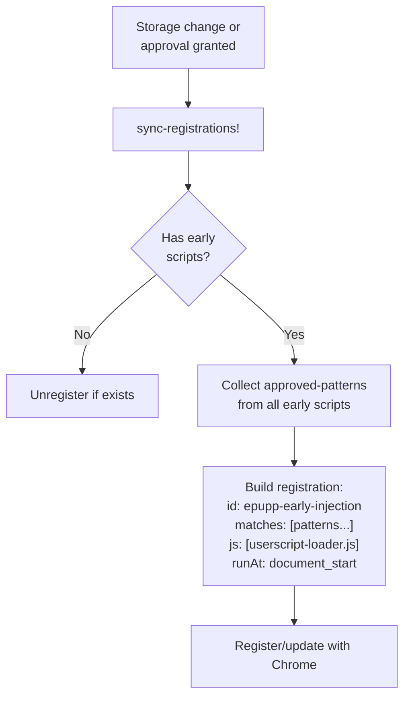
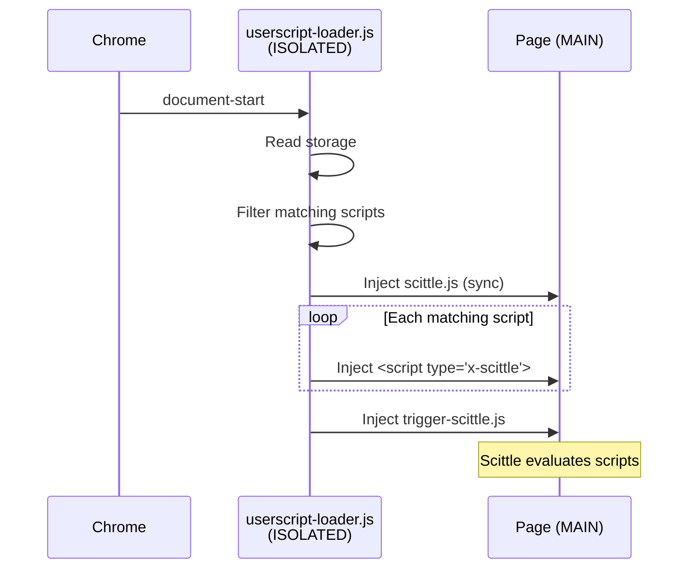

# Epupp Injection Flows

This document describes how code gets injected and evaluated across the three main workflows.

## Injection Flows

### REPL Connection (from Popup)

See [connected-repl.md](connected-repl.md) for full details including message flow diagrams.

1. User clicks "Connect" in popup
2. Popup sends `connect-tab` message to background worker with `tabId` and `wsPort`
3. Background's `connect-tab!` orchestrates the connection:
   - Execute `check-status-fn` in page context
   - If no bridge: inject `content-bridge.js` (ISOLATED world)
   - Inject `ws-bridge.js` (MAIN world) if needed
   - Wait for bridge ready (ping/pong)
   - Ensure Scittle is loaded
   - Set `SCITTLE_NREPL_WEBSOCKET_PORT` global
   - Inject `vendor/scittle.nrepl.js` (auto-connects)
   - **Inject `epupp` namespace** (provides `manifest!` for library loading)
4. `ws-bridge` intercepts WebSocket for `/_nrepl` URLs
5. Messages flow: Page ↔ Content Bridge ↔ Background ↔ Babashka relay

### Userscript Auto-Injection (on Navigation)

1. `webNavigation.onCompleted` fires (main frame only)
2. `handle-navigation!` waits for storage initialization
3. `process-navigation!` gets matching enabled scripts
4. For each script, check if matching pattern is approved
5. **Approved**: `ensure-scittle!` → `execute-scripts!`
6. **Unapproved**: `request-approval!` (adds to pending, updates badge)
7. `execute-scripts!` flow:
   - Inject content bridge
   - Wait for bridge ready (ping/pong)
   - Send `clear-userscripts` message
   - Send `inject-userscript` for each script
   - Send `inject-script` for `trigger-scittle.js`

### Panel Evaluation (from DevTools)

1. User enters code, presses Ctrl+Enter
2. `:editor/ax.eval` action dispatched
3. Check `:panel/scittle-status`:
   - If `:loaded`: evaluate directly
   - Otherwise: send `ensure-scittle` to background, then eval
4. `eval-in-page!` uses `chrome.devtools.inspectedWindow.eval`
5. Wrapper calls `scittle.core.eval_string(code)`
6. Result returned via `:editor/ax.handle-eval-result`

## Content Script Registration

Scripts with early timing (`document-start` or `document-end`) use a different injection path than the default `document-idle` scripts. This enables userscripts to run before page scripts execute.

### Injection Timing Options

| Value | Description | Injection Path |
|-------|-------------|----------------|
| `document-start` | Before page scripts run | `registerContentScripts` + loader |
| `document-end` | At DOMContentLoaded | `registerContentScripts` + loader |
| `document-idle` | After page load (default) | `webNavigation.onCompleted` |

Scripts specify timing via the `:epupp/run-at` annotation in code, parsed by `manifest_parser.cljs`.

### Registration Architecture

Early scripts use `chrome.scripting.registerContentScripts` API:

**Key design decisions:**
- Single registration ID (`epupp-early-injection`) covers all early scripts
- Registration fires the loader for union of all approved patterns
- Loader filters to scripts matching current URL at runtime
- `persistAcrossSessions: true` survives browser restarts

### Userscript Loader Flow

The loader ([userscript-loader.js](../../../extension/userscript-loader.js)) runs in ISOLATED world at document-start:

1. Guard against multiple injections (`window.__epuppLoaderInjected`)
2. Read all scripts from `chrome.storage.local`
3. Filter to enabled scripts with early timing and approved pattern matching current URL
4. Inject `vendor/scittle.js` synchronously (blocks until loaded)
5. Inject each matching script as `<script type="application/x-scittle">`
6. Inject `trigger-scittle.js` to evaluate all Scittle scripts

### Dual Injection Path Summary

| Timing | Trigger | Registration | Loader | Notes |
|--------|---------|--------------|--------|------|
| `document-idle` | `webNavigation.onCompleted` | No | No | Background orchestrates via content bridge |
| `document-start` | Chrome content script | Yes | Yes | Runs before page scripts |
| `document-end` | Chrome content script | Yes | Yes | Runs at DOMContentLoaded |

Early scripts bypass the background worker's injection orchestration entirely - the loader handles everything.
