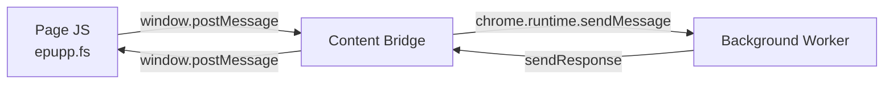

# Epupp Message Protocol

All cross-context communication uses JavaScript objects with a `type` field. Source identifiers distinguish origins in `window.postMessage` communication.

## Page ↔ Content Bridge

Via `window.postMessage` with source identifiers.

**Page → Content Bridge** (`source: "epupp-page"`):

| Type | Payload | Purpose |
|------|---------|---------|
| `ws-connect` | `{port}` | Request WebSocket connection |
| `ws-send` | `{data}` | Send data through WebSocket |
| `load-manifest` | `{manifest}` | Request library injection via `epupp/manifest!` |

**Content Bridge → Page** (`source: "epupp-bridge"`):

| Type | Payload | Purpose |
|------|---------|---------|
| `bridge-ready` | - | Bridge loaded and ready |
| `ws-open` | - | WebSocket connected |
| `ws-message` | `{data}` | Incoming WebSocket message |
| `ws-error` | `{error}` | WebSocket error |
| `ws-close` | - | WebSocket closed |
| `manifest-response` | `{success, error?}` | Library injection result |

## Content Bridge ↔ Background

Via `chrome.runtime.sendMessage` / `chrome.tabs.sendMessage`.

**Content Bridge → Background**:

| Type | Payload | Purpose |
|------|---------|---------|
| `ws-connect` | `{port}` | Create WebSocket for tab |
| `ws-send` | `{data}` | Send through tab's WebSocket |
| `ping` | - | Keepalive (every 5s) |
| `load-manifest` | `{manifest}` | Forward library injection request |

**Background → Content Bridge**:

| Type | Payload | Purpose |
|------|---------|---------|
| `bridge-ping` | - | Check bridge readiness |
| `ws-open` | - | WebSocket connected |
| `ws-message` | `{data}` | Relay WebSocket message |
| `ws-error` | `{error}` | WebSocket error |
| `ws-close` | `{code, reason}` | WebSocket closed |
| `inject-script` | `{url}` | Inject script tag with src |
| `inject-userscript` | `{id, code}` | Inject `<script type="application/x-scittle">` |
| `clear-userscripts` | - | Remove old userscript tags |

## REPL FS Sync

REPL FS Sync extends the page bridge with file operations. The page sends a request with
`requestId` and receives a response with the same `requestId` so callers can resolve
the right promise.

### Page → Content Bridge (source: "epupp-page")

| Type | Payload | Purpose |
|------|---------|---------|
| `list-scripts` | `{lsHidden, requestId}` | List scripts (read-only) |
| `get-script` | `{name, requestId}` | Get script code by name (read-only) |
| `save-script` | `{code, enabled, force, requestId}` | Save script code (write) |
| `rename-script` | `{from, to, force, requestId}` | Rename script (write) |
| `delete-script` | `{name, force, requestId}` | Delete script (write) |

### Content Bridge → Page (source: "epupp-bridge")

| Type | Payload | Purpose |
|------|---------|---------|
| `list-scripts-response` | `{success, scripts, requestId}` | Response for `list-scripts` |
| `get-script-response` | `{success, code?, error?, requestId}` | Response for `get-script` |
| `save-script-response` | `{success, name?, error?, requestId}` | Response for `save-script` |
| `rename-script-response` | `{success, error?, requestId}` | Response for `rename-script` |
| `delete-script-response` | `{success, error?, requestId}` | Response for `delete-script` |

### Content Bridge → Background

| Type | Payload | Purpose |
|------|---------|---------|
| `list-scripts` | `{lsHidden}` | Request list of scripts |
| `get-script` | `{name}` | Request script code by name |
| `save-script` | `{code, enabled, force}` | Save script code |
| `rename-script` | `{from, to, force}` | Rename script |
| `delete-script` | `{name, force}` | Delete script |

### Background Responses

The background worker replies via `sendResponse` with `{success, ...}` data. Errors
use `success: false` and an `error` string. Write operations return an error when
FS REPL Sync is disabled.

## Popup/Panel → Background

Via `chrome.runtime.sendMessage`.

| Type | Payload | Response | Purpose |
|------|---------|----------|---------|
| `refresh-approvals` | - | - | Reload scripts, sync pending, update badge |
| `pattern-approved` | `{scriptId, pattern}` | - | Pattern approved, clear pending + execute |
| `ensure-scittle` | `{tabId}` | `{success, error?}` | Request Scittle injection |

## Related

### Source Files
- [src/content_bridge.cljs](../../src/content_bridge.cljs)
- [src/background.cljs](../../src/background.cljs)
- [extension/bundled/epupp/fs.cljs](../../extension/bundled/epupp/fs.cljs)

### Docs
- [docs/repl-fs-sync.md](../../docs/repl-fs-sync.md)
