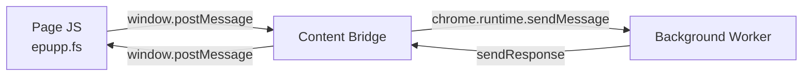

# Epupp Message Protocol

All cross-context communication uses JavaScript objects with a `type` field. Source identifiers distinguish origins in `window.postMessage` communication.

**Note:** Some page messages are handled entirely by the content bridge without a background round-trip (marked "handled locally" below). These include icon URL lookup and logging.

## Page ↔ Content Bridge

Via `window.postMessage` with source identifiers.

**Page → Content Bridge** (`source: "epupp-page"`):

| Type | Payload | Purpose |
|------|---------|---------|
| `ws-connect` | `{port}` | Request WebSocket connection |
| `ws-send` | `{data}` | Send data through WebSocket |
| `load-manifest` | `{manifest}` | Request library injection via `epupp.repl/manifest!` |
| `list-scripts` | `{lsHidden, requestId}` | List scripts (REPL FS read) |
| `get-script` | `{name, requestId}` | Get script by name (REPL FS read) |
| `save-script` | `{code, enabled, force, requestId, bulk-id?, bulk-index?, bulk-count?}` | Save script (REPL FS write) |
| `check-script-exists` | `{name, code}` | Check if script exists (web installer) |
| `web-installer-save-script` | `{code}` | Save script from whitelisted domain (web installer) |
| `rename-script` | `{from, to, force, requestId}` | Rename script (REPL FS write) |
| `delete-script` | `{name, force, requestId, bulk-id?, bulk-index?, bulk-count?}` | Delete script (REPL FS write) |
| `get-sponsored-username` | - | Get configured sponsor username |
| `get-icon-url` | `{requestId}` | Get extension icon URL (handled locally by bridge) |
| `log` | `{level, subsystem, messages}` | Log from page context (handled locally by bridge) |

**Page → Content Bridge** (`source: "epupp-userscript"`):

| Type | Payload | Purpose |
|------|---------|---------|
| `sponsor-status` | `{sponsor}` | Report sponsor detection (one-way `true` signal) |
**Content Bridge → Page** (`source: "epupp-bridge"`):

| Type | Payload | Purpose |
|------|---------|---------|
| `bridge-ready` | - | Bridge loaded and ready |
| `ws-open` | - | WebSocket connected |
| `ws-message` | `{data}` | Incoming WebSocket message |
| `ws-error` | `{error}` | WebSocket error |
| `ws-close` | - | WebSocket closed |
| `manifest-response` | `{success, error?}` | Library injection result |
| `list-scripts-response` | `{success, scripts, requestId}` | Response for `list-scripts` |
| `get-script-response` | `{success, code?, error?, requestId}` | Response for `get-script` |
| `save-script-response` | `{success, name?, error?, requestId}` | Response for `save-script` |
| `rename-script-response` | `{success, error?, requestId}` | Response for `rename-script` |
| `delete-script-response` | `{success, error?, requestId}` | Response for `delete-script` |
| `get-icon-url-response` | `{url, requestId}` | Response for `get-icon-url` |

## Content Bridge ↔ Background

Via `chrome.runtime.sendMessage` / `chrome.tabs.sendMessage`.

**Content Bridge → Background**:

| Type | Payload | Purpose |
|------|---------|---------|
| `ws-connect` | `{port}` | Create WebSocket for tab |
| `ws-send` | `{data}` | Send through tab's WebSocket |
| `ping` | - | Keepalive (every 5s) |
| `load-manifest` | `{manifest}` | Forward library injection request |
| `check-script-exists` | `{name, code}` | Check script existence (web installer) |
| `web-installer-save-script` | `{code}` | Save script from whitelisted domain |
| `sponsor-status` | `{sponsor}` | Sponsor detection (fire-and-forget via `send-message-safe!`) |
| `get-sponsored-username` | - | Get configured sponsor username |

**Background → Content Bridge**:

| Type | Payload | Purpose |
|------|---------|---------|
| `bridge-ping` | - | Check bridge readiness |
| `ws-open` | - | WebSocket connected |
| `ws-message` | `{data}` | Relay WebSocket message |
| `ws-error` | `{error}` | WebSocket error |
| `ws-close` | `{code, reason}` | WebSocket closed |
| `inject-script` | `{url}` | Inject script tag with src |
| `inject-userscript` | `{id, code}` | Inject `<script type="application/x-scittle">` |
| `clear-userscripts` | - | Remove old userscript tags |

## REPL FS Sync

REPL FS Sync extends the page bridge with file operations. The page sends a request with
`requestId` and receives a response with the same `requestId` so callers can resolve
the right promise.

### Page → Content Bridge (source: "epupp-page")

| Type | Payload | Purpose |
|------|---------|---------|
| `list-scripts` | `{lsHidden, requestId}` | List scripts (read-only) |
| `get-script` | `{name, requestId}` | Get script code by name (read-only) |
| `save-script` | `{code, enabled, force, requestId}` | Save script code (write) |
| `rename-script` | `{from, to, force, requestId}` | Rename script (write) |
| `delete-script` | `{name, force, requestId}` | Delete script (write) |

### Content Bridge → Page (source: "epupp-bridge")

| Type | Payload | Purpose |
|------|---------|---------|
| `list-scripts-response` | `{success, scripts, requestId}` | Response for `list-scripts` |
| `get-script-response` | `{success, code?, error?, requestId}` | Response for `get-script` |
| `save-script-response` | `{success, name?, error?, requestId}` | Response for `save-script` |
| `rename-script-response` | `{success, error?, requestId}` | Response for `rename-script` |
| `delete-script-response` | `{success, error?, requestId}` | Response for `delete-script` |

### Content Bridge → Background

| Type | Payload | Purpose |
|------|---------|---------|
| `list-scripts` | `{lsHidden}` | Request list of scripts |
| `get-script` | `{name}` | Request script code by name |
| `save-script` | `{code, enabled, force}` | Save script code |
| `rename-script` | `{from, to, force}` | Rename script |
| `delete-script` | `{name, force}` | Delete script |

### Background Responses

The background worker replies via `sendResponse` with `{success, ...}` data. Errors
use `success: false` and an `error` string. All FS operations (reads and writes)
return an error when FS REPL Sync is not enabled for the requesting tab or the
tab has no active WebSocket connection. Only one tab can have FS sync enabled at
a time.

## Popup/Panel → Background

Via `chrome.runtime.sendMessage`.

| Type | Payload | Response | Purpose |
|------|---------|----------|---------|
| `get-connections` | - | `{success, connections}` | List active REPL connections |
| `disconnect-tab` | `{tabId}` | - | Disconnect REPL from a tab |
| `check-status` | `{tabId}` | `{success, status}` | Check Scittle and bridge status |
| `ensure-scittle` | `{tabId}` | `{success, error?}` | Request Scittle injection |
| `inject-libs` | `{tabId, libs}` | `{success, error?}` | Inject Scittle libraries for eval |
| `evaluate-script` | `{tabId, scriptId, code, inject}` | `{success, error?}` | Run a script in the current tab |
| `panel-save-script` | `{script}` | `{success, error?, isUpdate?, id?}` | Save script from DevTools panel |
| `panel-rename-script` | `{from, to}` | `{success, error?}` | Rename script from DevTools panel |
| `toggle-fs-sync` | `{tabId, enabled}` | `{success}` | Enable/disable FS sync for a tab (single-tab: enabling revokes other tabs) |
| `get-fs-sync-status` | `{tabId}` | `{fsSyncTabId}` | Query FS sync status (null when no tab has sync enabled) |

## Background → Popup/Panel

| Type | Payload | Purpose |
|------|---------|---------|
| `connections-changed` | `{connections}` | Broadcast connection list updates |
| `system-banner` | `{event-type, operation, script-name, error?, bulk-id?, bulk-index?, bulk-count?}` | System notification banner (FS operations, validation errors) |
| `fs-sync-status-changed` | `{fsSyncTabId}` | FS sync status changed (null when disabled) |

## Related

### Source Files
- [src/content_bridge.cljs](../../src/content_bridge.cljs)
- [src/background.cljs](../../src/background.cljs)
- [extension/bundled/epupp/fs.cljs](../../extension/bundled/epupp/fs.cljs)

### Docs
- [docs/repl-fs-sync.md](../../docs/repl-fs-sync.md)
- [dev/docs/architecture/repl-fs-sync.md](repl-fs-sync.md)
