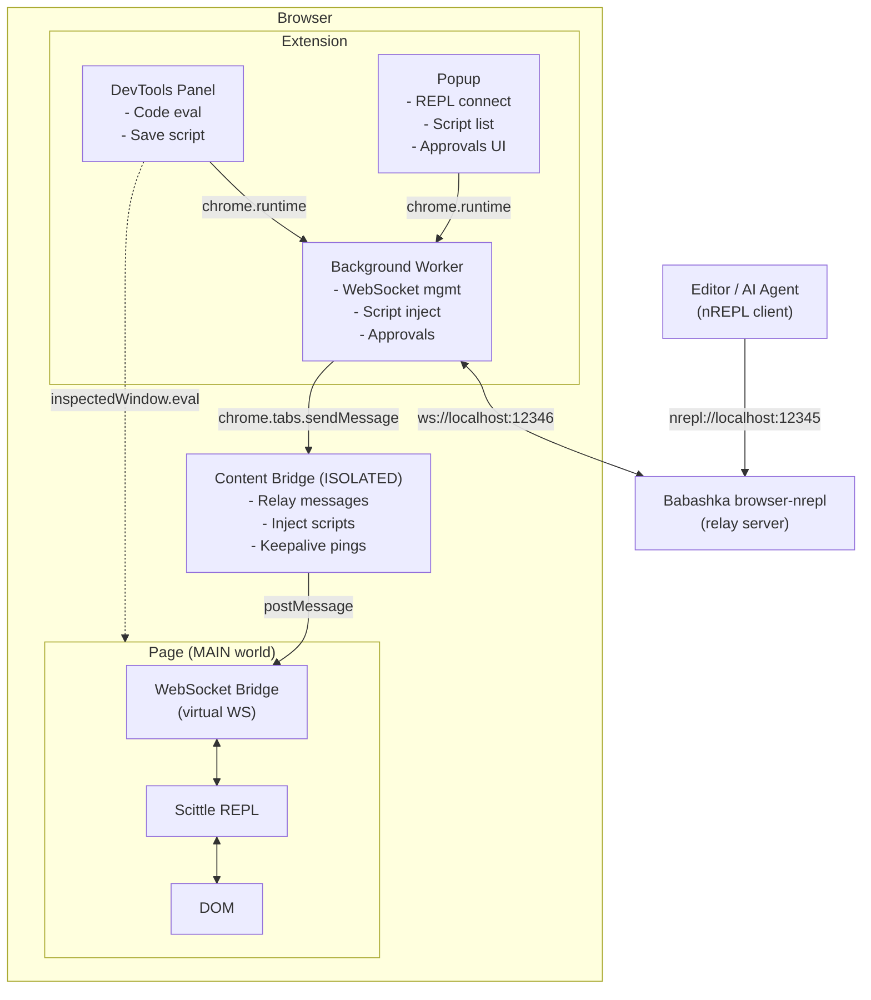

# Epupp Architecture Overview

Epupp bridges your Clojure editor to the browser's page execution environment through a multi-layer message relay system.

The architecture handles three main use cases:

1. **REPL Connection** - Live code evaluation from editor via nREPL
2. **Userscript Auto-Injection** - Saved scripts execute on matching URLs
3. **DevTools Panel Evaluation** - Direct evaluation from the panel UI

## Component Architecture

**Note:** Panel evaluates code directly in page context via `chrome.devtools.inspectedWindow.eval` (dotted line), but requests Scittle injection via background worker.

## Navigate

| Topic | Read This |
|------|-----------|
| Source file map + dependencies | [components.md](components.md) |
| Message types + payloads | [message-protocol.md](message-protocol.md) |
| State atoms + action/effect tables | [state-management.md](state-management.md) |
| Uniflow event system | [uniflow.md](uniflow.md) |
| REPL/userscripts/panel injection flows | [injection-flows.md](injection-flows.md) |
| Trust boundaries + CSP strategy | [security.md](security.md) |
| Build pipeline + configuration injection | [build-pipeline.md](build-pipeline.md) |
| CSS architecture + design tokens | [css-architecture.md](css-architecture.md) |

## Related

- Userscript design decisions: [../userscripts-architecture.md](../userscripts-architecture.md)
- Development workflow and build commands: [../dev.md](../dev.md)
