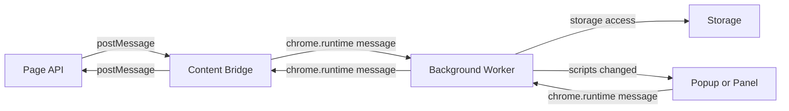

## Overview

REPL FS Sync lets page code read and write userscripts through a controlled
message pipeline. Read operations are always available. Write operations are
gated by a setting in the extension. UI save operations from the panel or
popup bypass the gate because they are already trusted UI flows.

The wire protocol uses non-namespaced keys. This matters because Scittle
`clj->js` strips namespace prefixes and keywords are strings. Squint treats
keywords as strings too, so interop compares keyword and string values as
equal. Do not expect namespaced keys to survive page to extension transport.

## Goals and Non-goals

Goals:
- Provide a low-latency, deterministic read path for scripts.
- Gate write operations behind a user setting.
- Keep UI save flows independent of the gate.
- Preserve a consistent request and response shape with `requestId`.

Non-goals:
- Full file system access or arbitrary file IO.
- Server-side persistence beyond extension storage.
- Cross-origin data access from the page context.

## Contexts and Trust Boundary

There are three main contexts:
- Page API: runs in the page main world, sends requests via `postMessage`.
- Content Bridge: isolated world relay, enforces the security boundary.
- Background Worker: executes requests, touches storage and emits responses.

The content bridge is the security boundary. It validates message shape and
routes only the allowed message types into the extension context.

## Data Model and Invariants

Primary entities:
- Script record with `:script/id`, `:script/name`, `:script/match`,
  `:script/code`, `:script/enabled`, `:script/created`, `:script/modified`,
  `:script/run-at`, `:script/require`, and optional `:script/description`.
- Request envelope with `type`, `requestId`, `payload`.
- Response envelope with `requestId`, `success`, and `error` on failure.

Invariants:
- `requestId` is required on all page API requests and responses.
- Read operations always run, regardless of write gate state.
- Write operations are rejected when the setting gate is off.
- UI save bypass applies only to extension UI flows, not page API.
- Wire protocol keys are non-namespaced strings.
- Bulk operations include `bulk-id`, `bulk-index`, and `bulk-count` so UI can
   aggregate REPL writes and deletes.

## Message Flow and Wiring

## Filesystem Functions Implementation

The REPL FS functions live in the Scittle-side namespaces `epupp.fs` and
`epupp.repl`. They are bundled as Scittle source files and loaded
into the page at connect time. `epupp.fs` defines the user-facing functions
`ls`, `show`, `save!`, `mv!`, and `rm!` and implements a `send-and-receive`
helper that attaches a monotonically increasing `requestId` to each request.

Each function is a thin wrapper around `postMessage`. It sends a message type
such as `list-scripts` or `save-script` and waits for the matching response
type with the same `requestId`. Responses are converted to namespaced keys
before returning to the REPL caller.

## Making the API Available to the Connected REPL

When a tab connects, the background worker injects the Scittle API namespaces
into the page. The list of injected files is maintained in `epupp-api-files`.
`inject-epupp-api!` fetches each bundled `.cljs` file and sends it to the
content bridge using `inject-userscript`. After all files are injected it
fires `trigger-scittle.js` to evaluate and register the namespaces.

This means the REPL caller can directly require `epupp.fs` and `epupp.repl`
in the page environment. The injected code runs in Scittle, while the content
bridge and background worker run in Squint and service worker contexts.

## Read Operation Flow

1. Page API sends `list-scripts` or `get-script` with `requestId`.
2. Content Bridge validates and forwards to background.
3. Background reads from storage and returns a response with `requestId`.
4. Content Bridge relays back to page API for promise resolution.

Read operations are always available and do not consult the write gate.

## Write Operation Flow and Setting Gate

1. Page API sends `save-script`, `rename-script`, or `delete-script` with
   `requestId`.
2. Background checks the gate setting for REPL FS Sync writes.
3. If gated off, return `{success false, error ...}` with the same
   `requestId`.
4. If gated on, write to storage and return `{success true, ...}`.

UI save operations from panel or popup bypass the gate because they are
trusted extension UI flows. This bypass does not apply to page API requests.

## Background Uniflow Decision Flow

REPL FS write operations are implemented with a Uniflow-shaped decision
pipeline in the background worker. The background handler performs the gate
check, then dispatches a pure decision action that returns the state mutation
and effects to run.

Flow summary:
1. Message handler receives `save-script`, `rename-script`, or `delete-script`.
2. Gate check runs in `background.cljs`. If disabled, respond immediately.
3. If enabled, the handler constructs a script map or names and calls
   `bg-fs-dispatch/dispatch-fs-action!` with a `:fs/ax.*` action.
4. `background-actions/handle-action` runs pure decision logic and returns
   `:uf/db` and `:uf/fxs` effects for persist, broadcast, and response.
5. `bg-fs-dispatch` executes effects in order, persists storage, and sends the
   response back to the content bridge.

This keeps validation deterministic and testable. The Uniflow pattern is
currently scoped to FS operations in the background worker. Other background
paths still use direct imperative flows.

## UI Reactivity and Badge Updates

UI reactivity is source-agnostic. Popup and panel react to storage changes
from REPL FS, panel edits, popup edits, and background updates.

## Error Handling and Return Shapes

All responses include `requestId` so the page API can resolve the correct
promise. Error responses use:
- `success` set to false
- `error` string

Successful responses use:
- `success` set to true
- Operation-specific fields such as `name`, `scripts`, `code`, `id`, and
   `isUpdate` where relevant

The page API converts results to namespaced `:fs/*` keys before returning to
REPL callers. The background also broadcasts `system-banner` messages to popup and
panel so UI can show success and error banners.

## Security Considerations

- Content Bridge is the security boundary. It validates message type, origin,
  and shape before forwarding.
- Page API is untrusted. It never bypasses the write gate.
- Use non-namespaced keys in the wire protocol to avoid namespace stripping.

## Testing and Observability

- Unit tests cover request validation, gating, and script mutations.
- E2E tests cover full message paths across page, bridge, and background.
- Log-powered tests verify background behavior without fragile UI checks.

## Related Docs

- [docs/repl-fs-sync.md](docs/repl-fs-sync.md)
- [../architecture.md](../architecture.md)
- [dev/docs/architecture/message-protocol.md](dev/docs/architecture/message-protocol.md)
- [dev/docs/architecture/uniflow.md](dev/docs/architecture/uniflow.md)
- [dev/docs/architecture/background-uniflow-implementation.md](dev/docs/architecture/background-uniflow-implementation.md)
- [dev/docs/architecture/state-management.md](dev/docs/architecture/state-management.md)
- [dev/docs/testing-e2e.md](dev/docs/testing-e2e.md)

## References

### Official Documentation

- [Chrome Extensions messaging](https://developer.chrome.com/docs/extensions/mv3/messaging/)
- [Window.postMessage](https://developer.mozilla.org/en-US/docs/Web/API/Window/postMessage)

### Project Implementation

- [src/content_bridge.cljs](src/content_bridge.cljs)
- [src/background.cljs](src/background.cljs)
- [src/background_actions.cljs](src/background_actions.cljs)
- [src/bg_fs_dispatch.cljs](src/bg_fs_dispatch.cljs)
- [src/popup_actions.cljs](src/popup_actions.cljs)
- [src/panel_actions.cljs](src/panel_actions.cljs)
- [src/storage.cljs](src/storage.cljs)
- [extension/bundled/epupp/fs.cljs](extension/bundled/epupp/fs.cljs)
- [extension/bundled/epupp/repl.cljs](extension/bundled/epupp/repl.cljs)
- [extension/trigger-scittle.js](extension/trigger-scittle.js)

### Related Research

- [dev/docs/architecture/message-protocol.md](dev/docs/architecture/message-protocol.md)
- [dev/docs/architecture/uniflow.md](dev/docs/architecture/uniflow.md)
- [dev/docs/architecture/background-uniflow-implementation.md](dev/docs/architecture/background-uniflow-implementation.md)
- [dev/docs/architecture/security.md](dev/docs/architecture/security.md)
- [dev/docs/repl-fs-api-issues.md](dev/docs/repl-fs-api-issues.md)
- [dev/docs/fs-write-enable-setting.md](dev/docs/fs-write-enable-setting.md)
