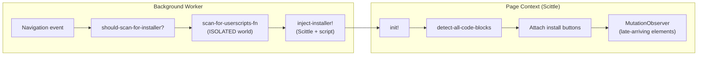

# Web Userscript Installer

The web installer detects userscript manifests on code hosting pages and adds "Install" buttons, enabling one-click script installation from GitHub gists, GitLab snippets, and other supported sites.

## Design Philosophy

The installer uses **conditional injection**: rather than loading Scittle on every whitelisted page, the background worker first scans the DOM for manifest markers using a lightweight JavaScript function in the ISOLATED world. Only when manifests are found does it inject Scittle and the full installer script.

## Architecture Overview

The flow has two distinct phases:

1. **Background scanning** - lightweight DOM check to decide whether to inject
2. **Page-side detection** - full manifest parsing and UI rendering via Scittle/Replicant

## Background Scanning Pipeline

### Origin Whitelist

Scanning is restricted to known code hosting origins, defined in `background_utils.cljs`:

- `github.com`, `gist.github.com`
- `gitlab.com`
- `codeberg.org`
- `localhost`, `127.0.0.1` (development)

The same whitelist gates both the background scan decision and the `web-installer-save-script` message handler (see [security.md](security.md)).

### Gate: `should-scan-for-installer?`

Located in `background_utils.cljs`. Checks two conditions:

1. URL origin is in the whitelist
2. Tab ID is not in `!installer-injected-tabs` (prevents duplicate injection)

When the installer is disabled (`:script/enabled false`), `maybe-inject-installer!` in `background.cljs` skips injection even if the gate passes.

### Scan: `scan-for-userscripts-fn`

A plain JavaScript function executed via `chrome.scripting.executeScript` in the ISOLATED world. Checks specific DOM formats first, then generic elements, returning early on first match of `:epupp/script-name` in the first 500 characters:

1. GitHub gist tables (`table.js-file-line-container`)
2. GitHub repo file view (`.react-code-lines`)
3. GitLab snippets (`.file-holder pre`)
4. Generic `<pre>` (excluding `.file-holder`, `.CodeMirror`)
5. `<textarea>` (excluding `.js-code-editor`)

Returns `true` on first match, or `false` after checking all formats.

### Retry Schedule

The background scanner retries with bounded delays: `[0, 300, 1000, 3000ms]` (total ~4.3s). This handles lazy-loaded DOM elements common on GitLab. Exits early when manifests are found.

### Injection

When manifests are found, `inject-installer!` in `bg_inject.cljs` ensures Scittle is loaded and then injects the installer script via the standard `execute-scripts!` pipeline. The installer depends on Replicant (`scittle://replicant.js`) for UI rendering.

### Tab Tracking

`!installer-injected-tabs` is an ephemeral atom (not Uniflow state). Cleared on:
- Tab close
- Page navigation (`onBeforeNavigate`)
- Service worker restart

Worst case on loss is a redundant scan - the installer itself is idempotent.

## Page-Side Installer Script

Source: `extension/userscripts/epupp/web_userscript_installer.cljs`

This is a Scittle script (SCI-evaluated in the browser), not compiled by Squint.

### State

The installer manages local state in two atoms:

- `!state` - main state with blocks, UI, modal, button containers, observer references
- `!scan-in-progress` - concurrency guard preventing overlapping scans

### Initialization (`init!`)

1. Set `install-allowed?` based on current origin
2. Set up UI container (modal overlay for install confirmations)
3. Initial scan: `rescan!` (immediate if DOM ready, else on `DOMContentLoaded`)
4. Register SPA navigation listener (once) using `window.navigation` API
5. Fetch extension icon URL (once)

### Code Block Detection

`detect-all-code-blocks` runs detectors in priority order (more specific first):

| Priority | Detector | Format Key | Selector | Sites |
|----------|----------|------------|----------|-------|
| 1 | `detect-github-tables` | `:github-table` | `table.js-file-line-container` | GitHub gists |
| 2 | `detect-github-repo-files` | `:github-repo` | `.react-code-lines` | GitHub repo file view |
| 3 | `detect-gitlab-snippets` | `:gitlab-snippet` | `.file-holder` | GitLab snippets |
| 4 | `detect-gitlab-comment-code-blocks` | `:gitlab-comment` | `.markdown-code-block` | GitLab comments |
| 5 | `detect-pre-elements` | `:pre` | `pre` (generic) | Any site |
| 6 | `detect-textarea-elements` | `:textarea` | `textarea` | Any site |

Each detector returns `{:element :format :code-text}`. Later detectors exclude elements already matched by earlier ones (e.g., `detect-pre-elements` excludes `.file-holder` and `.markdown-code-block`).

### Format Specs and Button Placement

Each format has a spec controlling button attachment:

| Format | Tag | Insert Strategy | Notes |
|--------|-----|-----------------|-------|
| `:github-table` | `span` | `:append` to `.file-actions` | Inside gist file header |
| `:gitlab-snippet` | `span` | `:append` to `.file-actions` | Inside snippet file header |
| `:github-repo` | `span` | `:append` to container | Inside repo file header |
| `:gitlab-comment` | `span` | `:overlay` (absolute positioned) | Overlay on code block, next to copy button |
| `:pre` | `div` | `:before` the pre element | Block div above the code |
| `:textarea` | `div` | `:before` the textarea | Block div above the textarea |

### Scan Pipeline

1. `rescan!` - entry point, clears existing buttons and state, then scans
2. `scan-with-retry!` - scans with page-side retry delays `[100, 1000, 3000ms]`
3. `scan-code-blocks!` - detects blocks, processes unprocessed ones in parallel
4. `process-code-block!+` - extracts manifest, checks script status via message to background, creates button

The `!scan-in-progress` atom prevents overlapping scans. This guards against the MutationObserver triggering a scan while `scan-with-retry!` is still running.

### SPA Navigation Support

Uses the `window.navigation` API to detect `pushState` navigations (GitHub/GitLab SPAs):

1. Navigation event fires with new URL
2. Immediate `cleanup-buttons!` removes all existing buttons from DOM
3. Debounced `rescan!` after 500ms lets the SPA framework render new content
4. New scan detects buttons on the new page

### MutationObserver

Watches `document.body` for late-arriving `.file-holder` and `.markdown-code-block` elements (GitLab lazy-loading). Debounced at 250ms. Skipped when a scan is already in progress.

### Install Flow

When a user clicks an install button:

1. If on a whitelisted origin: sends `web-installer-save-script` message to background
2. If on a non-whitelisted origin: shows modal with code for manual copy-paste
3. Background validates origin, saves script via `save-script!`
4. Button updates to show "Update" or "Installed" state

## Enable/Disable

The installer appears in the popup's Special section (`:script/special? true`) with an enable/disable checkbox. The checkbox is shown because the script has `:script/web-installer-scan true`, which indicates a conditional injection path that can be toggled.

- Scripts with `:web-installer-scan` default to **enabled** on first install
- The user's preference is preserved across extension updates
- When disabled, `maybe-inject-installer!` skips both scanning and injection entirely
- The toggle dispatches `[:popup/ax.toggle-script]` like any other script

## Script Metadata Flags

Defined in `base-builtins` in `storage.cljs`:

| Flag | Value | Purpose |
|------|-------|---------|
| `:special?` | `true` | Groups in "Special" popup section |
| `:web-installer-scan` | `true` | Conditional injection path - enables toggle, defaults to enabled on first install |

These propagate through `build-bundled-script` as `:script/special?` and `:script/web-installer-scan`.

## Security

- **Dual origin validation**: background checks origin before scanning; `web-installer-save-script` handler re-validates sender origin
- **Content isolation**: background scanner runs in ISOLATED world (no page script access)
- **Manifest validation**: requires valid `:epupp/script-name`
- **Script name restrictions**: `epupp/` prefix is reserved for built-in scripts

See [security.md](security.md) for the full trust boundary model.

## Test Coverage

| Test File | Scope |
|-----------|-------|
| `e2e/conditional_installer_test.cljs` | Origin gating, DOM scanning, retry behavior |
| `e2e/delayed_installer_test.cljs` | Retry detection at various delays |
| `e2e/installer_spa_cleanup_test.cljs` | SPA navigation cleanup and re-rendering |
| `e2e/web_installer/security_test.cljs` | Origin validation, sandbox escapes |
| `e2e/web_installer/format_test.cljs` | Format detection across code hosting sites |
| `e2e/web_installer/installation_test.cljs` | Save workflow |
| `e2e/web_installer/state_test.cljs` | UI state management |
| `e2e/web_installer/disabled_test.cljs` | Disabled installer does not inject |
| `e2e/builtin_reinstall_test.cljs` | Builtin sync, enabled state preservation |
| `test/web_installer_security_test.cljs` | Unit tests for origin validation |

## Key Source Files

| File | Role |
|------|------|
| `src/background.cljs` | `maybe-inject-installer!`, navigation handlers |
| `src/background_utils.cljs` | `should-scan-for-installer?`, origin whitelist, scan delays |
| `src/bg_inject.cljs` | `scan-for-userscripts-fn`, `inject-installer!` |
| `extension/userscripts/epupp/web_userscript_installer.cljs` | Page-side installer (Scittle) |
| `src/storage.cljs` | Builtin registration, `base-builtins` |
| `src/popup.cljs` | Special script checkbox rendering |
| `src/script_utils.cljs` | Enabled state defaults for special scripts |
