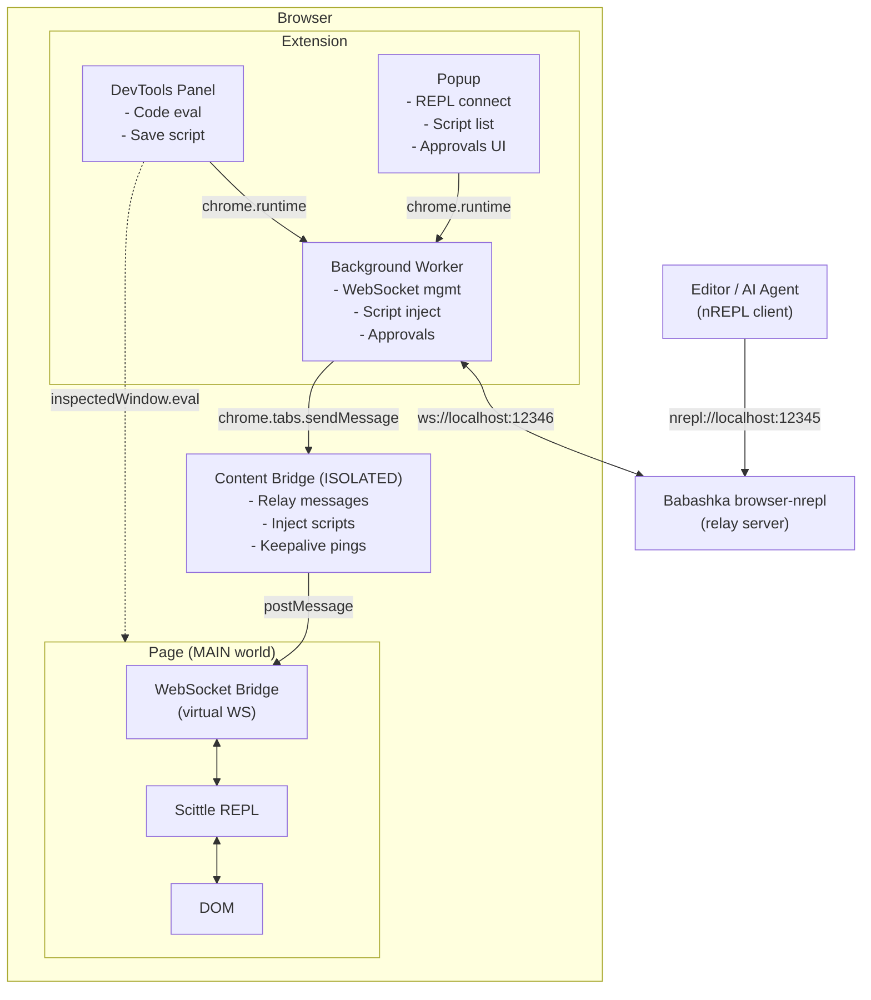
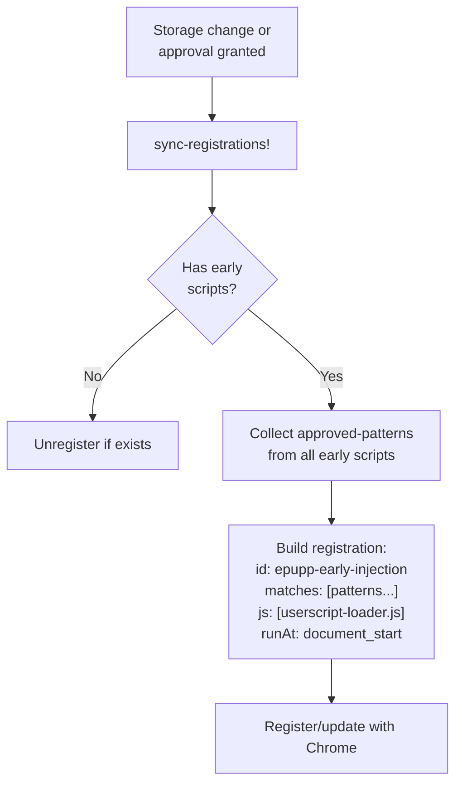
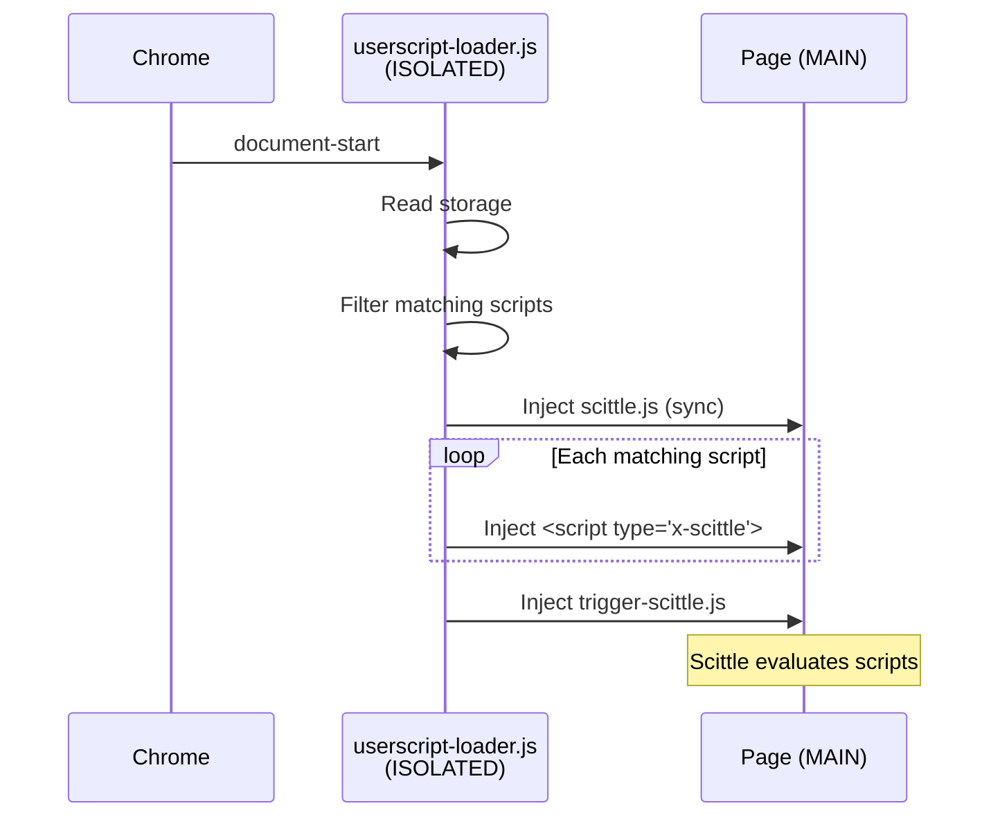
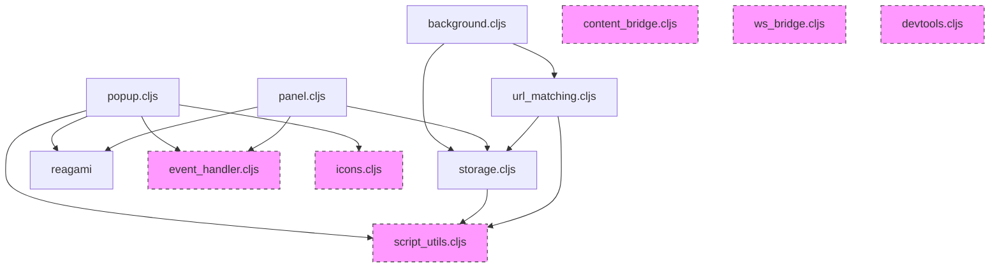
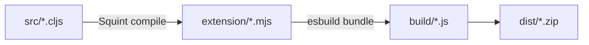

# Epupp Architecture

This document describes the technical architecture of the Epupp browser extension, serving as the authoritative reference derived from the source code.

## Overview

Epupp bridges your Clojure editor to the browser's page execution environment through a multi-layer message relay system. The architecture handles three main use cases:

1. **REPL Connection** - Live code evaluation from editor via nREPL
2. **Userscript Auto-Injection** - Saved scripts execute on matching URLs
3. **DevTools Panel Evaluation** - Direct evaluation from the panel UI

## Component Architecture



**Note:** Panel evaluates code directly in page context via `chrome.devtools.inspectedWindow.eval` (dotted line), but requests Scittle injection via background worker.

## Source Files

| File | Context | Purpose |
|------|---------|---------|
| `background.cljs` | Service Worker | WebSocket management, script injection orchestration, approval handling |
| `registration.cljs` | Service Worker | Content script registration for early-timing scripts |
| `content_bridge.cljs` | Content Script (ISOLATED) | Message relay, DOM injection, keepalive |
| `userscript-loader.js` | Content Script (ISOLATED) | Early script injection at document-start |
| `ws_bridge.cljs` | Page Script (MAIN) | Virtual WebSocket for Scittle REPL |
| `popup.cljs` | Extension Popup | REPL connection UI, script management |
| `panel.cljs` | DevTools Panel | Code evaluation, script editing |
| `devtools.cljs` | DevTools Entry | Registers the panel |
| `storage.cljs` | Shared | Script CRUD, chrome.storage.local |
| `url_matching.cljs` | Shared | URL pattern matching with storage |
| `script_utils.cljs` | Shared | Pure utilities for script data and URL pattern matching |
| `manifest_parser.cljs` | Shared | Parse `:epupp/run-at` and other annotations from code |
| `event_handler.cljs` | Shared | Uniflow event system |
| `icons.cljs` | Shared | SVG icon components |

## Message Protocol

All messages are JavaScript objects with a `type` field. Source identifiers distinguish origins in `postMessage` communication.

### Page ↔ Content Bridge

Via `window.postMessage` with source identifiers.

**Page → Content Bridge** (`source: "epupp-page"`):
| Type | Payload | Purpose |
|------|---------|---------|
| `ws-connect` | `{port}` | Request WebSocket connection |
| `ws-send` | `{data}` | Send data through WebSocket |

**Content Bridge → Page** (`source: "epupp-bridge"`):
| Type | Payload | Purpose |
|------|---------|---------|
| `bridge-ready` | - | Bridge loaded and ready |
| `ws-open` | - | WebSocket connected |
| `ws-message` | `{data}` | Incoming WebSocket message |
| `ws-error` | `{error}` | WebSocket error |
| `ws-close` | - | WebSocket closed |

### Content Bridge ↔ Background

Via `chrome.runtime.sendMessage` / `chrome.tabs.sendMessage`.

**Content Bridge → Background**:
| Type | Payload | Purpose |
|------|---------|---------|
| `ws-connect` | `{port}` | Create WebSocket for tab |
| `ws-send` | `{data}` | Send through tab's WebSocket |
| `ping` | - | Keepalive (every 5s) |

**Background → Content Bridge**:
| Type | Payload | Purpose |
|------|---------|---------|
| `bridge-ping` | - | Check bridge readiness |
| `ws-open` | - | WebSocket connected |
| `ws-message` | `{data}` | Relay WebSocket message |
| `ws-error` | `{error}` | WebSocket error |
| `ws-close` | `{code, reason}` | WebSocket closed |
| `inject-script` | `{url}` | Inject script tag with src |
| `inject-userscript` | `{id, code}` | Inject `<script type="application/x-scittle">` |
| `clear-userscripts` | - | Remove old userscript tags |

### Popup/Panel → Background

Via `chrome.runtime.sendMessage`.

| Type | Payload | Response | Purpose |
|------|---------|----------|---------|
| `refresh-approvals` | - | - | Reload scripts, sync pending, update badge |
| `pattern-approved` | `{scriptId, pattern}` | - | Pattern approved, clear pending + execute |
| `ensure-scittle` | `{tabId}` | `{success, error?}` | Request Scittle injection |

## State Management

Each component maintains its own state atom with namespaced keys.

### Background Worker (`background.cljs`)

```clojure
;; Uses `def` (not defonce) so state resets on service worker wake.
;; WebSocket connections don't survive script termination anyway.

!init-promise  ; atom - initialization promise (reset per wake)
!state         ; atom
  {:ws/connections {}        ; tab-id -> WebSocket instance
   :pending/approvals {}}    ; approval-id -> approval context map

;; Approval context shape:
{:approval/id "script-id|pattern"
 :script/id "..."
 :script/name "..."
 :script/code "..."
 :approval/pattern "..."
 :approval/tab-id 123}
```

### Content Bridge (`content_bridge.cljs`)

```clojure
!state  ; atom
  {:bridge/connected? false
   :bridge/keepalive-interval nil}
```

### WebSocket Bridge (`ws_bridge.cljs`)

```clojure
!state  ; atom
  {:bridge/ready? false
   :ws/message-handler nil}  ; current event listener reference
```

### Popup (`popup.cljs`)

```clojure
!state  ; atom, rendered via add-watch
  {:ports/nrepl "1339"
   :ports/ws "1340"
   :ui/status nil
   :ui/copy-feedback nil
   :ui/has-connected false
   :ui/editing-hint-script-id nil
   :ui/sections-collapsed {:repl-connect false      ; expanded by default
                           :matching-scripts false  ; expanded by default
                           :other-scripts false     ; expanded by default
                           :settings true}          ; collapsed by default
   :browser/brave? false
   :scripts/list []
   :scripts/current-url nil
   :settings/user-origins []    ; User-added allowed script origins
   :settings/new-origin ""      ; Input field for new origin
   :settings/default-origins []} ; Config origins (read-only)
```

### Panel (`panel.cljs`)

```clojure
!state  ; atom, rendered via add-watch, persisted per hostname
  {:panel/results []
   :panel/code ""
   :panel/evaluating? false
   :panel/scittle-status :unknown  ; :checking, :loading, :loaded
   :panel/script-name ""
   :panel/script-match ""
   :panel/script-id nil            ; non-nil when editing
   :panel/save-status nil
   :panel/init-version nil
   :panel/needs-refresh? false
   :panel/current-hostname nil
   :panel/selection nil}           ; {:start int :end int :text string} or nil
```

### Storage (`storage.cljs`)

```clojure
!db  ; atom, synced with chrome.storage.local
  {:storage/scripts []
   :storage/granted-origins []        ; reserved for future use
   :storage/user-allowed-origins []}  ; user-added allowed script origins
```

## Uniflow Event System

The popup and panel use a Re-frame-inspired unidirectional data flow pattern called Uniflow. See [uniflow.instructions.md](../../.github/uniflow.instructions.md) for full documentation.

### Popup Actions (`:popup/ax.*`)

| Action | Args | Purpose |
|--------|------|---------|
| `:popup/ax.set-nrepl-port` | `[port]` | Update nREPL port, persist to storage |
| `:popup/ax.set-ws-port` | `[port]` | Update WebSocket port, persist to storage |
| `:popup/ax.copy-command` | - | Copy bb server command to clipboard |
| `:popup/ax.connect` | - | Initiate REPL connection to current tab |
| `:popup/ax.check-status` | - | Check if page has Scittle/bridge loaded |
| `:popup/ax.load-saved-ports` | - | Load ports from chrome.storage |
| `:popup/ax.load-scripts` | - | Load userscripts from storage |
| `:popup/ax.load-current-url` | - | Get current tab URL for matching |
| `:popup/ax.toggle-script` | `[script-id pattern]` | Toggle script enabled, revoke pattern on disable |
| `:popup/ax.delete-script` | `[script-id]` | Remove script from storage |
| `:popup/ax.approve-script` | `[script-id pattern]` | Add pattern to approved list, execute script |
| `:popup/ax.deny-script` | `[script-id]` | Disable script (deny approval) |
| `:popup/ax.inspect-script` | `[script-id]` | Send script to DevTools panel for viewing/editing |
| `:popup/ax.show-settings` | - | Switch to settings view |
| `:popup/ax.show-main` | - | Switch to main view |
| `:popup/ax.load-user-origins` | - | Load user origins from storage |
| `:popup/ax.set-new-origin` | `[value]` | Update new origin input field |
| `:popup/ax.add-origin` | - | Validate and add origin to user list |
| `:popup/ax.remove-origin` | `[origin]` | Remove origin from user list |

### Panel Actions (`:editor/ax.*`)

| Action | Args | Purpose |
|--------|------|---------|
| `:editor/ax.set-code` | `[code]` | Update code textarea |
| `:editor/ax.set-script-name` | `[name]` | Update script name field |
| `:editor/ax.set-script-match` | `[pattern]` | Update URL pattern field |
| `:editor/ax.set-selection` | `[{:start :end :text}]` | Track current textarea selection |
| `:editor/ax.eval` | - | Evaluate full code (inject Scittle if needed) |
| `:editor/ax.eval-selection` | - | Evaluate selection if present, else full code |
| `:editor/ax.do-eval` | `[code]` | Execute evaluation (internal) |
| `:editor/ax.handle-eval-result` | `[result]` | Process eval result/error |
| `:editor/ax.save-script` | - | Save current code as userscript |
| `:editor/ax.load-script-for-editing` | `[id name match code]` | Load script from popup |
| `:editor/ax.clear-results` | - | Clear results area |
| `:editor/ax.clear-code` | - | Clear code textarea |
| `:editor/ax.use-current-url` | - | Fill pattern from current page URL |
| `:editor/ax.check-scittle` | - | Check Scittle status in page |
| `:editor/ax.update-scittle-status` | `[status]` | Update status (`:unknown`, `:checking`, `:loading`, `:loaded`) |
| `:editor/ax.check-editing-script` | - | Check for script sent from popup |

### Generic Actions (`:db/ax.*`)

| Action | Args | Purpose |
|--------|------|---------|
| `:db/ax.assoc` | `[k v ...]` | Directly update state keys |

### Generic Effects (`:uf/fx.*`, `:log/fx.*`)

| Effect | Args | Purpose |
|--------|------|---------|
| `:uf/fx.defer-dispatch` | `[actions timeout-ms]` | Dispatch actions after delay |
| `:log/fx.log` | `[level & messages]` | Log to console (`:debug`, `:log`, `:info`, `:warn`, `:error`) |

## Injection Flows

### REPL Connection (from Popup)

1. User clicks "Connect" in popup
2. Popup sends `connect-tab` message to background worker with `tabId` and `wsPort`
3. Background's `connect-tab!` orchestrates the connection:
   - Execute `check-status-fn` in page context
   - If no bridge: inject `content-bridge.js` (ISOLATED world)
   - Inject `ws-bridge.js` (MAIN world) if needed
   - Wait for bridge ready (ping/pong)
   - Ensure Scittle is loaded
   - Set `SCITTLE_NREPL_WEBSOCKET_PORT` global
   - Inject `vendor/scittle.nrepl.js` (auto-connects)
4. `ws-bridge` intercepts WebSocket for `/_nrepl` URLs
5. Messages flow: Page ↔ Content Bridge ↔ Background ↔ Babashka relay

### Userscript Auto-Injection (on Navigation)

1. `webNavigation.onCompleted` fires (main frame only)
2. `handle-navigation!` waits for storage initialization
3. `process-navigation!` gets matching enabled scripts
4. For each script, check if matching pattern is approved
5. **Approved**: `ensure-scittle!` → `execute-scripts!`
6. **Unapproved**: `request-approval!` (adds to pending, updates badge)
7. `execute-scripts!` flow:
   - Inject content bridge
   - Wait for bridge ready (ping/pong)
   - Send `clear-userscripts` message
   - Send `inject-userscript` for each script
   - Send `inject-script` for `trigger-scittle.js`

### Panel Evaluation (from DevTools)

1. User enters code, presses Ctrl+Enter
2. `:editor/ax.eval` action dispatched
3. Check `:panel/scittle-status`:
   - If `:loaded`: evaluate directly
   - Otherwise: send `ensure-scittle` to background, then eval
4. `eval-in-page!` uses `chrome.devtools.inspectedWindow.eval`
5. Wrapper calls `scittle.core.eval_string(code)`
6. Result returned via `:editor/ax.handle-eval-result`

## Content Script Registration

Scripts with early timing (`document-start` or `document-end`) use a different injection path than the default `document-idle` scripts. This enables userscripts to run before page scripts execute.

### Injection Timing Options

| Value | Description | Injection Path |
|-------|-------------|----------------|
| `document-start` | Before page scripts run | `registerContentScripts` + loader |
| `document-end` | At DOMContentLoaded | `registerContentScripts` + loader |
| `document-idle` | After page load (default) | `webNavigation.onCompleted` |

Scripts specify timing via the `:epupp/run-at` annotation in code, parsed by `manifest_parser.cljs`.

### Registration Architecture

Early scripts use `chrome.scripting.registerContentScripts` API:



**Key design decisions:**
- Single registration ID (`epupp-early-injection`) covers all early scripts
- Registration fires the loader for union of all approved patterns
- Loader filters to scripts matching current URL at runtime
- `persistAcrossSessions: true` survives browser restarts

### Userscript Loader Flow

The loader ([userscript-loader.js](../../extension/userscript-loader.js)) runs in ISOLATED world at document-start:

1. Guard against multiple injections (`window.__epuppLoaderInjected`)
2. Read all scripts from `chrome.storage.local`
3. Filter to enabled scripts with early timing and approved pattern matching current URL
4. Inject `vendor/scittle.js` synchronously (blocks until loaded)
5. Inject each matching script as `<script type="application/x-scittle">`
6. Inject `trigger-scittle.js` to evaluate all Scittle scripts



### Dual Injection Path Summary

| Timing | Trigger | Registration | Loader | Notes |
|--------|---------|--------------|--------|-------|
| `document-idle` | `webNavigation.onCompleted` | No | No | Background orchestrates via content bridge |
| `document-start` | Chrome content script | Yes | Yes | Runs before page scripts |
| `document-end` | Chrome content script | Yes | Yes | Runs at DOMContentLoaded |

Early scripts bypass the background worker's injection orchestration entirely - the loader handles everything synchronously at `document-start`, before page scripts run.

## Module Dependencies



**Standalone modules** (dashed): No internal dependencies, can be used independently.

## Security Model

### Message Origin Isolation

The extension uses Chrome's built-in isolation between execution contexts:

| Context | Can call `chrome.runtime.sendMessage`? | Examples |
|---------|---------------------------------------|----------|
| Extension pages | Yes | popup.html, panel.html |
| Content scripts (ISOLATED world) | Yes | content_bridge.js |
| Page scripts (MAIN world) | **No** | userscripts, ws_bridge.js |

This means page scripts (including userscripts) **cannot** directly send messages to the background worker. They can only communicate via `window.postMessage` to the content bridge, which explicitly whitelists what to forward.

### Content Bridge as Security Boundary

The content bridge ([content_bridge.cljs](../../src/content_bridge.cljs)) is the sole gateway from page context to background. It explicitly handles only:

| Source | Message Type | Forwarded To | Purpose |
|--------|--------------|--------------|---------|
| `epupp-page` | `ws-connect` | Background | WebSocket relay for REPL |
| `epupp-page` | `ws-send` | Background | WebSocket relay for REPL |
| `epupp-userscript` | `install-userscript` | Background | Script installation (with origin validation) |

**Any message type not in this whitelist is silently dropped.** This prevents userscripts from spoofing popup/panel messages like `pattern-approved` or `evaluate-script`.

When adding new forwarded message types, consider: "What if any page script could call this?" If the answer involves privilege escalation, don't forward it.

### CSP Bypass Strategy

Strict Content Security Policies (GitHub, YouTube) block:
- Inline scripts
- `eval()`
- WebSocket connections to localhost

Our solution:
1. **Background worker** makes WebSocket connections (extension context bypasses page CSP)
2. **Content bridge** in ISOLATED world can inject script tags
3. **Scittle patched** to remove `eval()` usage (see `bb bundle-scittle`)

### Per-Pattern Approval

Despite having `<all_urls>` host permission (required for `scripting.executeScript`), we implement additional user control:

1. Each script tracks `:script/approved-patterns`
2. New URL patterns require explicit user approval
3. Disabling a script revokes all pattern approvals
4. Badge shows count of pending approvals

### Injection Guards

Scripts guard against multiple injections using global window flags:

| Module | Flag | Purpose |
|--------|------|---------|
| `content_bridge.cljs` | `window.__browserJackInBridge` | Prevent duplicate content bridge |
| `ws_bridge.cljs` | `window.__browserJackInWSBridge` | Prevent duplicate WS bridge |

## Build Pipeline



### Build-Time Configuration

Configuration is injected at bundle time via esbuild, not through a source file:

1. **Config files**: `config/dev.edn`, `config/prod.edn`, and `config/test.edn` contain build settings
2. **Build script**: `tasks.clj` reads the appropriate config based on mode
3. **Injection**: esbuild's `--define:EXTENSION_CONFIG=...` injects config as a global to all bundles
4. **Access**: All extension modules access it via `js/EXTENSION_CONFIG`

Config shape:
```clojure
{:dev true/false
 :test true/false   ; enables test instrumentation
 :depsString "{:deps {...}}"} ; bb -Sdeps string for browser-nrepl
```

See [dev.md](dev.md) for build commands.
