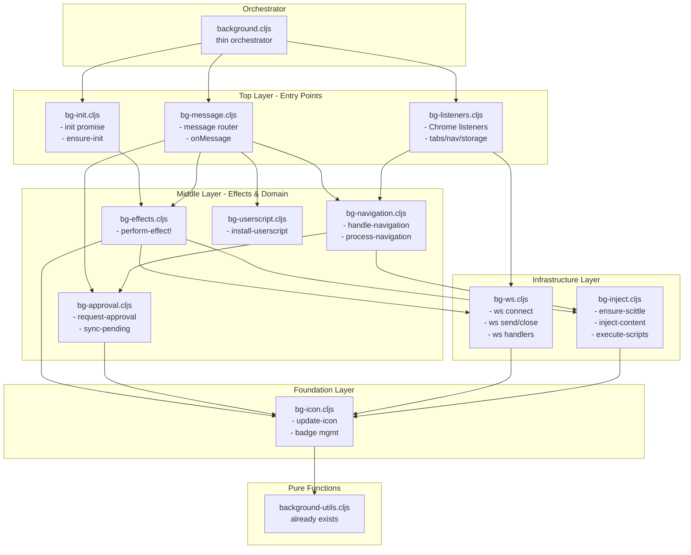

# Background.cljs Decomposition Plan

## Operating Principles

```
[phi fractal euler tao pi mu] | [delta lambda infinity/0 | epsilon phi sigma mu c h] | OODA
Human - AI - REPL
```

- **phi**: Golden balance between understanding and doing
- **fractal**: Each concern contains the seed of its module
- **tao**: The code reveals its natural boundaries - read it
- **OODA**: Observe deeply, Orient correctly, Decide wisely, Act decisively
- **Zero Forward Declares**: Definition order matters - functions must be defined before use

## Problem Statement

`background.cljs` has accumulated 22 forward declares - a clear signal of structural debt. The file is ~900 lines with mixed concerns: WebSocket management, icon state, navigation handling, script injection, message routing, and lifecycle events.

### Current Declare List (to be eliminated)

```clojure
(declare prune-icon-states!)
(declare update-icon-for-tab!
         update-icon-now!
         update-badge-for-tab!
         update-badge-for-active-tab!
         clear-pending-approval!
         connect-tab!
         ensure-initialized!
         ensure-scittle!
         execute-in-page
         check-status-fn
         inject-content-script
         find-tab-id-by-url-pattern!
         wait-for-bridge-ready
         inject-requires-sequentially!
         execute-scripts!
         sync-pending-approvals!
         install-userscript!
         get-active-tab-id)
```

## Current Module Structure

Already extracted (good foundation):
- `background-utils.cljs` - Pure utility functions
- `background-actions.cljs` - Uniflow action router
- `background-actions/*.cljs` - Domain-specific pure action handlers
- `bg-fs-dispatch.cljs` - FS operation dispatch bridge

Still tangled in `background.cljs`:
- WebSocket connection management
- Icon state management
- Badge management
- Script injection (Scittle, bridge, userscripts)
- Navigation handling
- Message listener (giant case statement)
- Chrome API listeners (tabs, webNavigation, storage, runtime)
- Initialization lifecycle

## Target Architecture

Split into focused modules with clear dependency ordering:



### Dependency Rules (No Cycles)

1. **Pure modules** (no declares needed): `background-utils.cljs`
2. **Foundation modules**: `bg-icon.cljs` - depends only on pure utils
3. **Infrastructure modules**: `bg-inject.cljs`, `bg-ws.cljs` - depend on icon
4. **Effects module**: `bg-effects.cljs` - depends on inject, ws, icon
5. **Initialization**: `bg-init.cljs` - depends on effects (for icon pruning)
6. **Message routing**: `bg-message.cljs` - depends on all above
7. **Listeners**: `bg-listeners.cljs` - depends on message, init
8. **Orchestrator**: `background.cljs` - wires everything, minimal code

## TDD Protocol

**Before EVERY phase:**
```bash
bb test          # Unit tests must pass
bb test:e2e      # E2E tests must pass
```

**After EVERY phase:**
```bash
bb test          # Unit tests must still pass
bb test:e2e      # E2E tests must still pass
```

**If tests fail**: Stop, diagnose, fix before proceeding.

## Delegation protocol

Delegate all edits to the Clojure-editor subagent.

## Phased Execution Plan

### Phase 0: Baseline Verification
- [x] Run `bb test` - **349 tests passing**
- [x] Run `bb test:e2e` - **85 tests passing (20 files, 6 shards)**
- [x] Commit current state with message: "chore: baseline before background.cljs decomposition"

### Phase 1: Extract Icon Management (`bg-icon.cljs`)

**Goal**: Move icon/badge state management to dedicated module.

**Functions to extract**:
- `get-icon-paths` (already delegates to utils)
- `compute-display-icon-state` (already delegates to utils)
- `update-icon-now!`
- `update-icon-for-tab!`
- `dispatch-icon-action!`
- `get-icon-state`
- `clear-icon-state!`
- `prune-icon-states!`
- `set-badge!`
- `count-pending-for-url` (already delegates to utils)
- `update-badge-for-tab!`
- `update-badge-for-active-tab!`

**State needed**: Icon states accessed via `!state` atom

**Approach**:
1. Create `bg-icon.cljs` with icon functions
2. Module receives `!state` atom reference (dependency injection)
3. Update `background.cljs` to require and delegate
4. Read this plan again

**Declares eliminated**: `update-icon-for-tab!`, `update-icon-now!`, `update-badge-for-tab!`, `update-badge-for-active-tab!`, `prune-icon-states!`

### Phase 2: Extract WebSocket Management (`bg-ws.cljs`)

**Goal**: Consolidate WebSocket connection lifecycle.

**Functions to extract**:
- `get-ws`
- `close-ws!`
- `send-to-tab`
- `handle-ws-connect`
- `handle-ws-send`
- `handle-ws-close`
- `dispatch-ws-action!`
- `dispatch-history-action!`
- `broadcast-connections-changed!`

**Dependencies**: Needs icon module for `update-icon-for-tab!`

**Declares eliminated**: None directly, but enables later phases

### Phase 3: Extract Script Injection (`bg-inject.cljs`)

**Goal**: Isolate all Scittle/bridge/userscript injection logic.

**Functions to extract**:
- `inject-script-fn` (JS function constant)
- `check-scittle-fn` (JS function constant)
- `check-status-fn` (JS function constant)
- `poll-until`
- `execute-in-page`
- `inject-content-script`
- `ensure-scittle!`
- `wait-for-bridge-ready`
- `send-tab-message`
- `inject-requires-sequentially!`
- `execute-scripts!`
- `ensure-bridge!`
- `ensure-scittle-nrepl!`
- `inject-epupp-api!`
- `connect-tab!`
- Various JS function constants (`set-nrepl-config-fn`, `close-websocket-fn`, etc.)

**Dependencies**: Needs icon module for icon state updates

**Declares eliminated**: `ensure-scittle!`, `execute-in-page`, `check-status-fn`, `inject-content-script`, `wait-for-bridge-ready`, `inject-requires-sequentially!`, `execute-scripts!`, `connect-tab!`

### Phase 4: Extract Approval Management (`bg-approval.cljs`)

**Goal**: Consolidate approval workflow.

**Functions to extract**:
- `dispatch-approval-action!`
- `clear-pending-approval!`
- `sync-pending-approvals!`
- `request-approval!`

**Declares eliminated**: `clear-pending-approval!`, `sync-pending-approvals!`

### Phase 5: Extract Effects Handler (`bg-effects.cljs`)

**Goal**: Centralize `perform-effect!` - currently it's huge and references many functions.

**Approach**:
1. Move `perform-effect!` to dedicated module
2. It receives the other modules as dependencies
3. Clean separation of effect execution from action handling

**Declares eliminated**: Most remaining due to forward refs in `perform-effect!`

### Phase 6: Extract Navigation Handling (`bg-navigation.cljs`)

**Goal**: Isolate navigation processing logic.

**Functions to extract**:
- `process-navigation!`
- `handle-navigation!`
- Auto-connect/reconnect logic

**Dependencies**: Needs inject, icon, approval modules

### Phase 7: Extract Message Router (`bg-message.cljs`)

**Goal**: Move the giant `onMessage` case statement.

**Approach**:
1. Create message handler module
2. Each message type calls appropriate module
3. Keep `background.cljs` as thin orchestrator

### Phase 8: Extract Initialization (`bg-init.cljs`)

**Goal**: Clean initialization lifecycle.

**Functions to extract**:
- `!init-promise`
- `ensure-initialized!`
- Settings getters (`get-auto-connect-settings`, etc.)

**Declares eliminated**: `ensure-initialized!`

### Phase 9: Extract Userscript Installation (`bg-userscript.cljs`)

**Goal**: Isolate userscript installation logic.

**Functions to extract**:
- `install-userscript!`
- `allowed-script-origins`
- `url-origin-allowed?`

**Declares eliminated**: `install-userscript!`

### Phase 10: Extract Chrome Listeners (`bg-listeners.cljs`)

**Goal**: Move all `.addListener` calls to dedicated module.

**Listeners to move**:
- `chrome.tabs.onRemoved`
- `chrome.tabs.onActivated`
- `chrome.webNavigation.onBeforeNavigate`
- `chrome.webNavigation.onCompleted`
- `chrome.storage.onChanged`
- `chrome.runtime.onInstalled`
- `chrome.runtime.onStartup`

### Phase 11: Final Cleanup

**Goal**: `background.cljs` becomes thin orchestrator.

- [ ] Remove ALL declares (should be zero)
- [ ] Verify module dependency order is correct
- [ ] Update docstring to reflect new architecture
- [ ] Final test run

## Success Criteria

1. **Zero forward declares** in any module
2. **All tests pass** (unit and e2e)
3. **Clear module boundaries** - each module has single responsibility
4. **Proper dependency order** - no cycles, lower modules don't depend on higher
5. **Testable** - pure functions extracted where possible

## Risk Mitigation

- **Circular dependencies**: Map dependencies carefully before extracting
- **State access**: Use dependency injection (pass `!state` atom)
- **Chrome API timing**: Keep initialization in correct order
- **Test coverage**: Run full test suite after each phase

## Documentation Updates

After completion:
- [ ] Update [architecture/components.md](architecture/components.md) with new file map
- [ ] Add module diagram to architecture.md
- [ ] Update this plan with lessons learned

---

*This plan follows the fractal principle: each phase is self-contained and leaves the codebase in a working state.*
