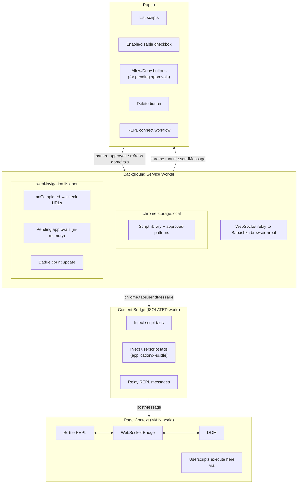
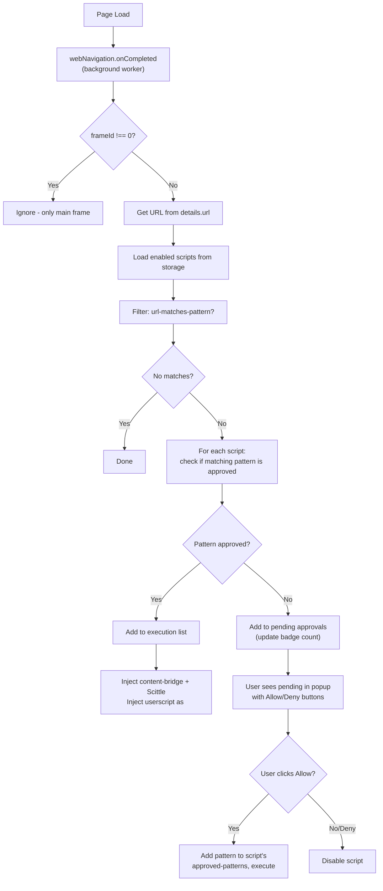

# Userscripts Architecture

**Created:** January 2, 2026
**Status:** Implemented

## Overview

Browser Jack-in's userscript support enables saved ClojureScript scripts to auto-execute on matching URLs. Unlike traditional userscript managers (TamperMonkey, ViolentMonkey), our focus is **interactive development first**, with script persistence as a natural extension.

## Design Philosophy

### Editor Is Not Our Job

The value prop is the **REPL connection**, not the editor:

| Context | Editor |
|---------|--------|
| Professional workflow | VS Code/Emacs jacked in via nREPL |
| Quick demo/exploration | Simple DevTools panel textarea |
| Simplest | DevTools Console + Scittle in page |

A minimal DevTools panel serves as the **on-ramp**; jacking in an editor is the destination for serious work.

### Compared to TamperMonkey

| Aspect | TamperMonkey | Browser Jack-in |
|--------|--------------|-----------------|
| Primary use | "Write once, run everywhere" | "Explore and iterate on *this* page *now*" |
| Complexity location | Complex UI, simple runtime | Simple UI, powerful runtime (nREPL + Scittle) |
| Editor | Built-in CodeMirror | External via nREPL (or minimal built-in) |
| Dashboard | Tab-based (global management) | Popup + DevTools (contextual) |

## Component Architecture



## Data Model

### Script Storage Schema

```clojure
;; Stored in chrome.storage.local under key "scripts"
{:storage/scripts
 [{:script/id "github-tweaks"               ; unique identifier
   :script/name "GitHub Tweaks"             ; display name
   :script/match ["*://github.com/*"        ; URL patterns (glob)
                  "*://gist.github.com/*"]
   :script/code "(println \"Hello GitHub!\")" ; ClojureScript source
   :script/enabled true                     ; active flag
   :script/created "2026-01-02T12:00:00Z"
   :script/modified "2026-01-02T14:30:00Z"
   :script/approved-patterns ["*://github.com/*"]}  ; patterns user has approved

  {:script/id "youtube-tweaks"
   :script/name "YouTube Tweaks"
   :script/match ["*://youtube.com/*"
                  "*://www.youtube.com/*"]
   :script/code "(js/console.log \"YT loaded\")"
   :script/enabled false
   :script/created "2026-01-02T13:00:00Z"
   :script/modified "2026-01-02T13:00:00Z"
   :script/approved-patterns []}]}

;; Note: granted-origins key exists for potential future use but is currently unused.
;; Per-pattern approval is handled via :script/approved-patterns on each script.
```

### Storage Access Pattern

`chrome.storage.local` is key-value blob storage—no queries, read-modify-write only. Our pattern:

1. **In-memory atom** mirrors storage for fast access and Clojure sequence operations
2. **Persist on mutation** — after `swap!`, write the whole blob back
3. **Listen for external changes** — popup, DevTools panel, and background worker share storage; use `chrome.storage.onChanged` to keep atoms in sync

### Script Metadata Annotations (Future)

For scripts loaded from files or shared, support TamperMonkey-style header comments:

```clojure
;; ==UserScript==
;; @name        GitHub Tweaks
;; @match       *://github.com/*
;; @match       *://gist.github.com/*
;; @description Enhance GitHub UX
;; ==/UserScript==

(ns github-tweaks)

(defn init []
  (println "GitHub Tweaks loaded!"))

(init)
```

## Permission Model

### Implemented Approach

We use `host_permissions` with `<all_urls>` because `chrome.scripting.executeScript` requires host permissions to be declared at install time. However, auto-injection is controlled by a **per-pattern approval system** stored in each script:

```json
{
  "permissions": ["scripting", "activeTab", "storage", "webNavigation"],
  "host_permissions": ["<all_urls>"]
}
```

**How it works:**
1. Extension installs with permission to access all URLs (required for `scripting.executeScript`)
2. When a page loads matching a script's URL pattern, we check `:script/approved-patterns`
3. If the matching pattern is NOT in approved-patterns, we prompt the user via the popup
4. User sees "Allow" / "Deny" buttons for the specific script on that pattern
5. On "Allow": pattern is added to `:script/approved-patterns` and script executes
6. On "Deny": script is disabled
7. A badge shows the count of pending approvals

**Trade-off:** Users see "Read and change all your data on all websites" warning at install, but this is unavoidable for userscript functionality. Our per-pattern approval provides additional user control beyond Chrome's built-in settings.

### Why Per-Pattern Approval?

The original plan was to rely on Chrome's "Site access" setting. In practice:
- `chrome.permissions.request()` requires a user gesture (can't call from background worker)
- We wanted more granular control than "all or nothing"
- Per-pattern approval lets users allow a script on `github.com/*` but not yet on `gist.github.com/*`
- Disabling a script also revokes its pattern approvals, so re-enabling requires re-approval

The `granted-origins` storage key is retained for potential future use but currently unused.

## Auto-Injection Flow



### Script Execution Method

Scripts are executed via Scittle's script tag mechanism rather than direct `eval_string`:

1. Content bridge injects `<script type="application/x-scittle">` tags with userscript code
2. A trigger script (`trigger-scittle.js`) tells Scittle to evaluate all unprocessed tags
3. This approach leverages Scittle's native loading mechanism

## UI Distribution

### Popup (Lightweight Management)

- List all scripts with enable/disable checkboxes and delete buttons
- Scripts matching current tab URL highlighted with green border (`.script-item-active`)
- Scripts needing approval highlighted with amber border (`.script-item-approval`)
- **Allow/Deny buttons** for scripts matching current URL but not yet approved
- Connection status and REPL connect workflow (unchanged from before)
- Port configuration for browser-nrepl
- Badge shows count of pending approvals across all tabs

### DevTools Panel (Development Focus)

- Simple textarea + Eval button (Ctrl+Enter shortcut)
- Results display with input echo, output, and errors
- **Save as Userscript** section:
  - Name input field
  - URL pattern field with **↵ button** to auto-fill from current page hostname
  - Save button (disabled until all fields filled)
  - Success/error feedback with auto-clear after 3 seconds
- Dark theme matching DevTools aesthetic
- Loads storage on init to share script data with popup

### Why Not a Dashboard Tab?

TamperMonkey's dashboard handles complex management for users with dozens of scripts from GreasyFork. Our target users:
- Develop their own scripts (fewer scripts, more iteration)
- Use external editors for serious work
- Want contextual tools (DevTools is already open while developing)

A popup + DevTools panel covers these needs without a separate dashboard.

## Future Considerations

### Script Sharing

- Export script as `.cljs` file with metadata header
- Import from file (parse header for match patterns)
- Potential: GreasyFork-style repository (later)

### Multi-Tab REPL

- Current: One REPL connection at a time
- Future: Multiple tabs connected, switch context in editor

### Sync Support

- `chrome.storage.sync` for cross-browser script library
- ~100KB limit—may need chunking for large scripts

## Related Documents

- [README.md](../../README.md) - Project overview and usage
- [docs/dev.md](../../docs/dev.md) - Development setup
- [.github/copilot-instructions.md](../../.github/copilot-instructions.md) - Architecture details

## Implementation Files

| File | Purpose |
|------|---------|
| `src/script_utils.cljs` | Shared utilities: script data transforms, URL pattern matching |
| `src/storage.cljs` | Script CRUD, atom-mirror pattern, per-pattern approval, `chrome.storage.local` |
| `src/url_matching.cljs` | Storage-dependent script filtering (uses script_utils) |
| `src/panel.cljs` | DevTools panel UI with eval and save |
| `src/devtools.cljs` | DevTools entry point (registers panel) |
| `src/popup.cljs` | Script list UI, toggle/delete/approve handlers, REPL connection |
| `src/background.cljs` | Auto-injection via `webNavigation.onCompleted`, pending approvals, badge updates |
| `src/content_bridge.cljs` | Content script: relays messages, injects userscript tags |
| `src/ws_bridge.cljs` | Page-context WebSocket bridge for nREPL connection |
| `extension/trigger-scittle.js` | Triggers Scittle to evaluate injected `<script type="application/x-scittle">` tags |
