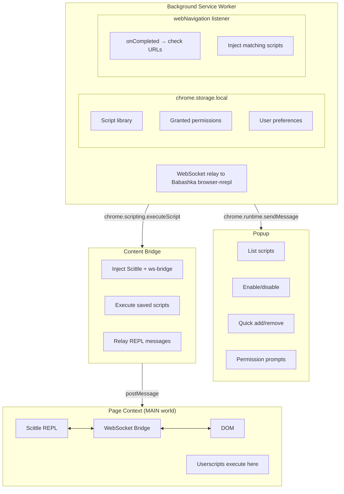
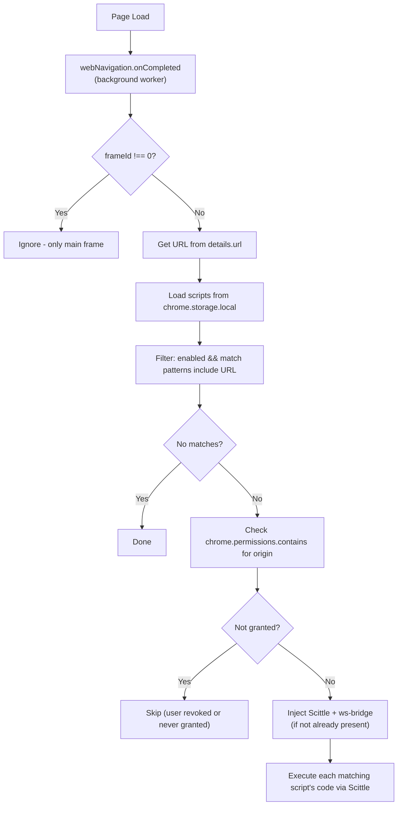

# Userscripts Architecture

**Created:** January 2, 2026
**Status:** Planning

## Overview

Browser Jack-in's userscript support enables saved ClojureScript scripts to auto-execute on matching URLs. Unlike traditional userscript managers (TamperMonkey, ViolentMonkey), our focus is **interactive development first**, with script persistence as a natural extension.

## Design Philosophy

### Editor Is Not Our Job

The value prop is the **REPL connection**, not the editor:

| Context | Editor |
|---------|--------|
| Professional workflow | VS Code/Emacs jacked in via nREPL |
| Quick demo/exploration | Simple DevTools panel textarea |
| Simplest | DevTools Console + Scittle in page |

A minimal DevTools panel serves as the **on-ramp**; jacking in an editor is the destination for serious work.

### Compared to TamperMonkey

| Aspect | TamperMonkey | Browser Jack-in |
|--------|--------------|-----------------|
| Primary use | "Write once, run everywhere" | "Explore and iterate on *this* page *now*" |
| Complexity location | Complex UI, simple runtime | Simple UI, powerful runtime (nREPL + Scittle) |
| Editor | Built-in CodeMirror | External via nREPL (or minimal built-in) |
| Dashboard | Tab-based (global management) | Popup + DevTools (contextual) |

## Component Architecture



## Data Model

### Script Storage Schema

```clojure
;; Stored in chrome.storage.local under key "scripts"
{:storage/scripts
 [{:script/id "github-tweaks"               ; unique identifier
   :script/name "GitHub Tweaks"             ; display name
   :script/match ["*://github.com/*"        ; URL patterns (glob)
                  "*://gist.github.com/*"]
   :script/code "(println \"Hello GitHub!\")" ; ClojureScript source
   :script/enabled true                     ; active flag
   :script/created "2026-01-02T12:00:00Z"
   :script/modified "2026-01-02T14:30:00Z"}

  {:script/id "youtube-tweaks"
   :script/name "YouTube Tweaks"
   :script/match ["*://youtube.com/*"
                  "*://www.youtube.com/*"]
   :script/code "(js/console.log \"YT loaded\")"
   :script/enabled false
   :script/created "2026-01-02T13:00:00Z"
   :script/modified "2026-01-02T13:00:00Z"}]}

;; Stored under key "granted-origins"
{:storage/granted-origins
 ["*://github.com/*"
  "*://gist.github.com/*"
  "*://youtube.com/*"]}
```

### Storage Access Pattern

`chrome.storage.local` is key-value blob storage—no queries, read-modify-write only. Our pattern:

1. **In-memory atom** mirrors storage for fast access and Clojure sequence operations
2. **Persist on mutation** — after `swap!`, write the whole blob back
3. **Listen for external changes** — popup, DevTools panel, and background worker share storage; use `chrome.storage.onChanged` to keep atoms in sync

### Script Metadata Annotations (Future)

For scripts loaded from files or shared, support TamperMonkey-style header comments:

```clojure
;; ==UserScript==
;; @name        GitHub Tweaks
;; @match       *://github.com/*
;; @match       *://gist.github.com/*
;; @description Enhance GitHub UX
;; ==/UserScript==

(ns github-tweaks)

(defn init []
  (println "GitHub Tweaks loaded!"))

(init)
```

## Permission Model

### Current State

```json
"permissions": ["scripting", "activeTab", "storage"]
```

`activeTab` only grants access when user clicks the extension—perfect for manual "Connect REPL" but insufficient for auto-injection.

### Runtime Permission Strategy

Instead of requesting `<all_urls>` upfront (scary warning), request permissions incrementally:

1. **Install time**: Minimal permissions (current)
2. **Script save time**: Prompt for specific origins
3. **Runtime**: Only inject on granted origins

```javascript
// When user saves a script for github.com:
chrome.permissions.request({
  origins: ["*://github.com/*"]
}, (granted) => {
  if (granted) {
    // Save to granted-origins list
    // Enable auto-injection for this pattern
  }
});
```

**Benefits:**
- User understands *why* permission is needed (they just saved a script)
- No scary "all websites" warning at install
- Permissions can be revoked per-origin

### Required Manifest Changes

```json
{
  "permissions": ["scripting", "activeTab", "storage", "webNavigation"],
  "optional_host_permissions": ["<all_urls>"]
}
```

The `optional_host_permissions` allows runtime requests without granting anything at install.

## Auto-Injection Flow



## UI Distribution

### Popup (Lightweight Management)

- List all scripts with enable/disable toggles
- "New Script" button → opens DevTools panel or prompts
- Status indicators (which scripts active on current tab)
- Quick access to settings

### DevTools Panel (Development Focus)

- Simple textarea + Eval button for quick testing
- "Save as Script" button → prompts for name, match patterns
- View/edit scripts matching current page
- REPL output display

### Why Not a Dashboard Tab?

TamperMonkey's dashboard handles complex management for users with dozens of scripts from GreasyFork. Our target users:
- Develop their own scripts (fewer scripts, more iteration)
- Use external editors for serious work
- Want contextual tools (DevTools is already open while developing)

A popup + DevTools panel covers these needs without a separate dashboard.

## Future Considerations

### Script Sharing

- Export script as `.cljs` file with metadata header
- Import from file (parse header for match patterns)
- Potential: GreasyFork-style repository (later)

### Multi-Tab REPL

- Current: One REPL connection at a time
- Future: Multiple tabs connected, switch context in editor

### Sync Support

- `chrome.storage.sync` for cross-browser script library
- ~100KB limit—may need chunking for large scripts

## Related Documents

- [README.md](../../README.md) - Project overview and usage
- [docs/dev.md](../../docs/dev.md) - Development setup
- [.github/copilot-instructions.md](../../.github/copilot-instructions.md) - Architecture details
- [userscripts-implementation-plan.md](./userscripts-implementation-plan.md) - Implementation steps
