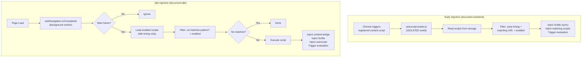

# Userscripts Architecture

**Created:** January 2, 2026
**Status:** Implemented

This document captures design decisions and rationale for the userscript feature. For technical implementation details (message protocols, state schemas, injection flows), see [architecture.md](architecture.md).

## Overview

Epupp's userscript support enables saved ClojureScript scripts to auto-execute on matching URLs. Unlike traditional userscript managers (TamperMonkey, ViolentMonkey), our focus is **interactive development first**, with script persistence as a natural extension.

## Design Philosophy

### Editor Is Not Our Job

The value prop is the **REPL connection**, not the editor:

| Context | Editor |
|---------|--------|
| Professional workflow | VS Code/Emacs jacked in via nREPL |
| Quick demo/exploration | Simple DevTools panel textarea |
| Simplest | DevTools Console + Scittle in page |

A minimal DevTools panel serves as the **on-ramp**; jacking in an editor is the destination for serious work.

### Compared to TamperMonkey

| Aspect | TamperMonkey | Epupp |
|--------|--------------|-----------------|
| Primary use | "Write once, run everywhere" | "Explore and iterate on *this* page *now*" |
| Complexity location | Complex UI, simple runtime | Simple UI, powerful runtime (nREPL + Scittle) |
| Editor | Built-in CodeMirror | External via nREPL (or minimal built-in) |
| Dashboard | Tab-based (global management) | Popup + DevTools (contextual) |

## Component Overview

See [architecture.md](architecture.md) for the full component diagram and technical details. Key userscript-related components:

- **Background Worker** - Handles `webNavigation.onCompleted`
- **Content Bridge** - Injects `<script type="application/x-scittle">` tags
- **Popup** - Script list with enable/disable controls
- **DevTools Panel** - Script editing and "Save as Userscript" functionality

## Data Model

### Script Storage Schema

See [architecture/state-management.md](architecture/state-management.md) for complete state schemas. Script fields:

```clojure
;; Stored in chrome.storage.local under key "scripts"
{:script/id "script-1700000000000"         ; immutable identifier
 :script/code "(println \"Hello GitHub!\")"  ; ClojureScript source
 :script/enabled true                      ; auto-run enabled flag
 :script/created "2026-01-02T..."          ; ISO timestamp
 :script/modified "2026-01-02T..."         ; ISO timestamp
 :script/builtin? false                    ; built-in flag
 :script/source :source/panel}             ; provenance (optional)
```

**Derived on load (from manifest in `:script/code`):**
- `:script/name` - `:epupp/script-name`
- `:script/match` - `:epupp/auto-run-match`
- `:script/description` - `:epupp/description`
- `:script/run-at` - `:epupp/run-at`
- `:script/inject` - `:epupp/inject`

**`:script/run-at` values:**
- `"document-start"` - Runs before page scripts (via `registerContentScripts` + loader)
- `"document-end"` - Runs at DOMContentLoaded (via `registerContentScripts` + loader)
- `"document-idle"` - Runs after page load (default, via `webNavigation.onCompleted`)

**`:script/inject` values:**
- Vector of `scittle://` URLs for bundled Scittle ecosystem libraries
- Dependencies are resolved automatically (e.g., `scittle://reagent.js` loads React)
- See README for available libraries

**`:script/source` provenance tracking:**

Optional field tracking where a script originated. Storage preserves this value exactly as provided by the caller:

| Source | Value | Set By |
|--------|-------|--------|
| DevTools panel | `:source/panel` | Panel save action |
| REPL FS API | `:source/repl` | `epupp.fs/save!` calls |
| Built-in scripts | `:source/built-in` | Built-in sync |
| Web installer | URL string (e.g., `"https://gist.github.com/PEZ/abc123"`) | Web Userscript Installer |

**Design rationale:**
- Keywords for internal sources - simple, no extra data needed
- URL string for web installs - retains provenance, useful for potential future update features
- Optional field - scripts without `:script/source` work fine
- Callers set source explicitly - storage never infers or modifies it

Scripts specify timing via a manifest map at the top of the file:

```clojure
{:epupp/script-name "github_tweaks.cljs"
 :epupp/auto-run-match "https://github.com/*"
 :epupp/description "Enhance GitHub UX"
 :epupp/run-at "document-start"
 :epupp/inject ["scittle://reagent.js"]}

(ns my-userscript)

;; This code runs before page scripts execute
(js/console.log "Intercepting page initialization!")
```

The manifest is parsed on load to derive runtime fields like `:script/run-at` and `:script/inject`. See [architecture/injection-flows.md](architecture/injection-flows.md#content-script-registration) for technical details.

Note: `grantedOrigins` storage key exists for potential future use but is currently unused.

**Script IDs are immutable.** Renaming a script updates `:script/name` but
preserves `:script/id` for stable identity.

**Namespace Reservation:** The `epupp/` prefix is reserved for system scripts. User scripts cannot begin with `epupp/` to prevent conflicts with built-in functionalit(defn- detect-textarea-elements
  "Find generic textarea elements, return array of {:element :format :code-text}.
   Excludes textareas inside .file containers with .file-actions (GitHub gist edit)."
  []
  (->> (.querySelectorAll js/document "textarea")
       js/Array.from
       (filter (fn [el]
                 (let [file-div (.closest el ".file")]
                   (or (not file-div)
                       (not (.querySelector file-div ".file-actions"))))))
       (map (fn [el]
              {:element el
               :format :textarea
               :code-text (get-textarea-text el)})))) after `swap!`, write the whole blob back
3. **Listen for external changes** - popup, DevTools panel, and background worker share storage; use `chrome.storage.onChanged` to keep atoms in sync

### Data Integrity Invariants

**`:script/match` is always a flat vector of strings.** All code paths that set this field produce flat vectors:

| Path | Code | Result |
|------|------|--------|
| Panel save | `normalize-match-patterns` parses manifest | `["pattern1" "pattern2"]` |
| Background install | `[auto-run-match]` wraps single string | `["pattern"]` |
| Built-in scripts | Hardcoded vectors | `["pattern"]` |

Nested arrays cannot occur in normal operation. If future import functionality is added, validate at import time rather than adding defensive flattening throughout the codebase. (January 2026: removed `normalize-match-array` after analysis confirmed it was unreachable defensive code.)

## Permission Model

### Implemented Approach

We use `host_permissions` with `<all_urls>` because `chrome.scripting.executeScript` requires host permissions to be declared at install time:

```json
{
  "permissions": ["scripting", "activeTab", "storage", "webNavigation"],
  "host_permissions": ["<all_urls>"]
}
```

**Why each permission is needed:**

- `scripting` - Inject userscripts via `chrome.scripting.executeScript`
  - **Without it:** Userscript injection fails completely
- `<all_urls>` - Host permissions for any site
  - **Without it:** Cannot inject into pages (required by `scripting.executeScript`)
- `storage` - Persist scripts and settings to `chrome.storage.local`
  - **Without it:** Scripts and settings lost on extension reload/browser restart
- `webNavigation` - Track page loads for auto-injection
  - **Without it:** Auto-injection on page navigation doesn't work
- `activeTab` - DevTools panel integration
  - **Without it:** DevTools panel cannot access inspected page

**How it works:**
1. Extension installs with permission to access all URLs (required for `scripting.executeScript`)
2. Scripts specify which URLs they match via `:script/match` patterns
3. Auto-injection is controlled by the `:script/enabled` checkbox in the popup
4. When enabled, scripts automatically run on matching URLs; when disabled, they don't

**Trade-off:** Users see "Read and change all your data on all websites" warning at install, but this is unavoidable for userscript functionality. Epupp uses the minimal permission set required for full functionality.

The `grantedOrigins` storage key is retained for potential future use but currently unused.

## Userscript Installation (from Page)

Epupp supports installing userscripts from the page via a built-in Web
Userscript Installer script. The installer extracts code directly from DOM
elements and sends a `save-script` request through the content bridge. The
background validates the manifest and saves the script with source provenance.

### Web Userscript Installer Test Pages

**Manual testing:**
- GitLab snippet: https://gitlab.com/-/snippets/4922251
- GitHub gist: https://gist.github.com/PEZ/9d2a9eec14998de59dde93979453247e
- GitHub repo file: (need example with manifest)
- GitLab repo file: https://gitlab.com/pappapez/userscripts-test/-/blob/main/pez/gitlab_repo_test_us.cljs

**E2E mock page:** `test-data/pages/mock-gist.html`

## Injection Timing

Scripts can run at different points in the page lifecycle. The timing is specified via `:epupp/run-at` in the script's code metadata.

### When to Use Each Timing

| Timing | Use Case | Examples |
|--------|----------|----------|
| `document-start` | Intercept page initialization, block scripts, modify globals | Ad blockers, analytics blockers, polyfills |
| `document-end` | Access DOM before images/iframes load | DOM manipulation that must run before page renders |
| `document-idle` | Most scripts (default) | UI enhancements, data extraction, page tweaks |

### document-start: Early Injection

Use `document-start` when your script needs to:
- **Intercept page scripts** before they run
- **Modify global objects** that page scripts depend on
- **Block or redirect requests** by overriding fetch/XHR
- **Polyfill APIs** the page will use

```clojure
{:epupp/run-at "document-start"}

(ns analytics-blocker)

;; Intercept before page scripts run
(set! js/window._gaq #js [])
(set! js/window.gtag (fn [& _]))
```

**Trade-off:** Early scripts use content script registration, which means Scittle loads on all pages matching any early script's approved patterns. This adds overhead to those URLs, even if you later disable the script (until the registration is cleaned up).

### document-idle: Default Timing

Most scripts should use the default `document-idle` (or omit `:epupp/run-at`):
- Runs after page load completes
- DOM is fully available
- Page scripts have finished initialization
- No overhead on non-matching pages

```clojure
;; No :epupp/run-at needed - document-idle is default
(ns github-tweaks)

;; Enhance the UI after page loads
(when-let [btn (js/document.querySelector ".merge-button")]
  (.addEventListener btn "click" #(js/console.log "Merge clicked!")))
```

### How Early vs Idle Injection Differs

| Aspect | Early (`document-start/end`) | Idle (`document-idle`) |
|--------|------------------------------|------------------------|
| Trigger | Content script registration | `webNavigation.onCompleted` event |
| Scittle loading | Synchronous, blocks page | On-demand per tab |
| Registration | Persists across browser restarts | None (event-driven) |
| Overhead | Scittle loads on all matching URLs | Only when scripts actually run |

## Auto-Injection Flow

Scripts take different injection paths based on their `:script/run-at` timing:



**Key difference:** Early scripts bypass the background worker's orchestration entirely. The loader handles everything synchronously at document-start. For `document-end` scripts, the loader still runs at document-start, so scripts that require DOM-ready should handle that in code.

For the detailed step-by-step implementation of injection flows, see [architecture/injection-flows.md](architecture/injection-flows.md#injection-flows).

## UI Distribution

### Popup (Lightweight Management)

- List all scripts with enable/disable checkboxes (for scripts with patterns only) and delete buttons
- Built-in scripts have a grey left border (`.script-item-builtin`) and cube icon
- Scripts without patterns show "No auto-run (manual only)" instead of checkbox
- Checkbox tooltip indicates "Auto-run enabled" or "Auto-run disabled" status
- Connection status and REPL connect workflow (unchanged from before)
- Port configuration for browser-nrepl
- Run button for ad-hoc evaluation of a script in the active tab
- Settings for auto-connect, auto-reconnect, and FS REPL sync

### DevTools Panel (Development Focus)

- Simple textarea + Eval button (Ctrl+Enter shortcut)
- Results display with input echo, output, and errors
- **Save as Userscript** section:
  - Name input field
  - URL pattern field with **↵ button** to auto-fill from current page hostname
  - Save button (disabled until all fields filled)
  - Success/error feedback with auto-clear after 3 seconds
- Dark theme matching DevTools aesthetic
- Loads storage on init to share script data with popup

### Why Not a Dashboard Tab?

TamperMonkey's dashboard handles complex management for users with dozens of scripts from GreasyFork. Our target users:
- Develop their own scripts (fewer scripts, more iteration)
- Use external editors for serious work
- Want contextual tools (DevTools is already open while developing)

A popup + DevTools panel covers these needs without a separate dashboard.

## Future Considerations

### Script Sharing

- Export script as `.cljs` file with metadata header
- Import from file (parse header for match patterns)
- Potential: GreasyFork-style repository (later)

### Script Metadata Annotations

For scripts loaded from files or shared, support TamperMonkey-style header comments:

```clojure
;; ==UserScript==
;; @name        GitHub Tweaks
;; @match       https://github.com/*
;; @match       https://gist.github.com/*
;; @description Enhance GitHub UX
;; ==/UserScript==

(ns github-tweaks)

(defn init []
  (println "GitHub Tweaks loaded!"))

(init)
```

### Multi-Tab REPL

- Current: One REPL connection at a time
- Future: Multiple tabs connected, switch context in editor

### Sync Support

- `chrome.storage.sync` for cross-browser script library
- ~100KB limit - may need chunking for large scripts

## Related Documents

- [README.md](../../README.md) - Project overview and usage
- [architecture.md](architecture.md) - Technical reference (state, messages, flows)
- [dev.md](dev.md) - Development setup
- [.github/copilot-instructions.md](../../.github/copilot-instructions.md) - AI agent instructions
