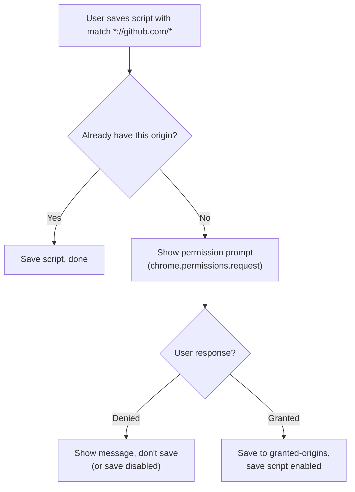
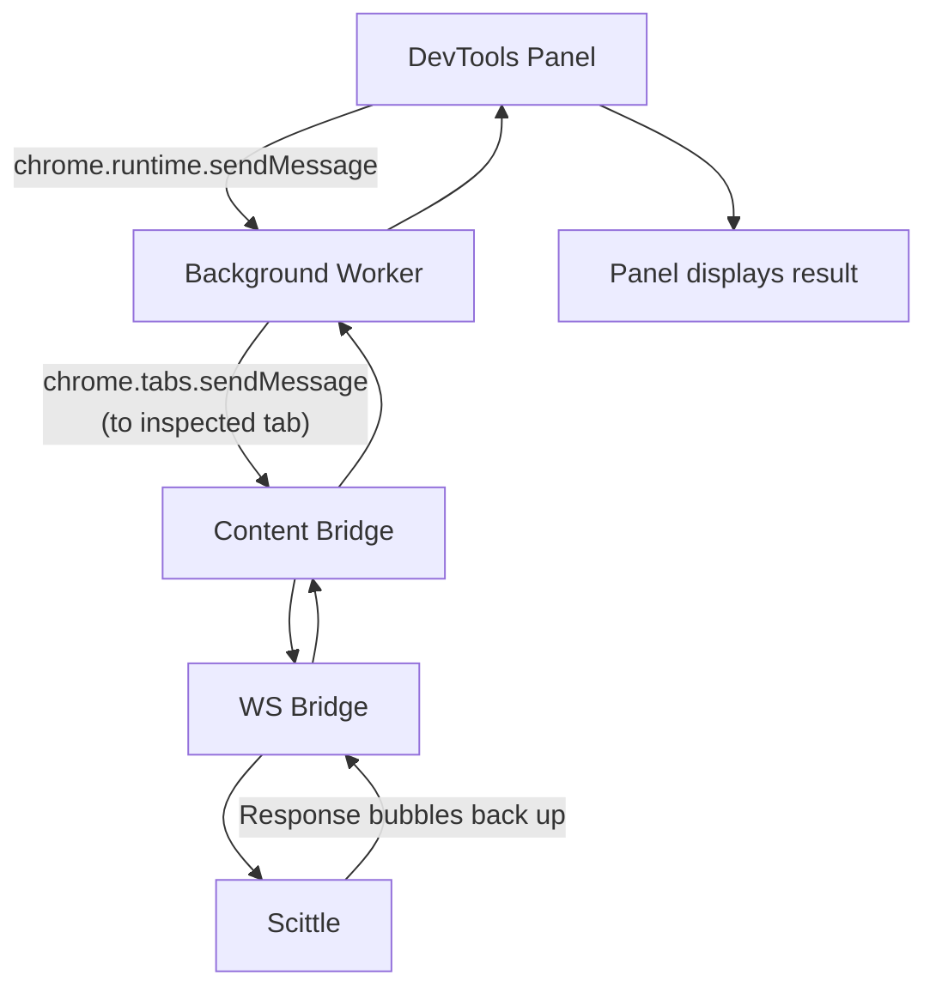

# Userscripts Implementation Plan

**Created:** January 2, 2026
**Status:** Planning

## Mandatory Reading

Before implementing, read these documents thoroughly:

1. **[userscripts-architecture.md](./userscripts-architecture.md)** - Architecture and design decisions
2. **[README.md](../../README.md)** - Project overview, message flow diagram
3. **[.github/copilot-instructions.md](../../.github/copilot-instructions.md)** - Build system, coding patterns, existing architecture
4. **[docs/dev.md](../../docs/dev.md)** - Development workflow

### Key Architectural Constraints

- **Squint compilation**: Source in `src/*.cljs` → compiled to `extension/*.mjs` → bundled to `build/*.js`
- **State management**: Single `!state` atom with namespaced keys
- **Message protocol**: `#js {:type "..." ...}` objects between contexts
- **CSP handling**: Background worker handles WebSocket (bypasses page CSP)

## Implementation Phases

### Phase 1: Storage Foundation

**Goal:** CRUD operations for scripts in `chrome.storage.local`

#### Tasks

- [ ] Create `src/storage.cljs` namespace with script storage functions
  - `get-scripts` - Load all scripts
  - `get-script` - Load single script by ID
  - `save-script!` - Create/update script
  - `delete-script!` - Remove script
  - `toggle-script!` - Enable/disable
  - `get-granted-origins` - Load permission list
  - `add-granted-origin!` - Track new permission
  - `remove-granted-origin!` - Track revoked permission

- [ ] Add storage initialization to background worker
  - Initialize empty `{:scripts [] :granted-origins []}` if not present

#### Data Validation

```clojure
(defn valid-script? [script]
  (and (string? (:id script))
       (string? (:name script))
       (seq (:match script))
       (every? string? (:match script))
       (string? (:code script))
       (boolean? (:enabled script))))
```

#### Testing

- Manually test via DevTools console on background page
- Verify persistence across extension reload

---

### Phase 2: URL Pattern Matching

**Goal:** Determine which scripts should run on a given URL

#### Tasks

- [ ] Create `src/url_matching.cljs` namespace
  - `pattern->regex` - Convert glob pattern to regex
  - `url-matches-pattern?` - Test single pattern
  - `get-matching-scripts` - Filter scripts by URL

#### Pattern Format

Support TamperMonkey-style globs:
- `*` matches any characters
- `?` matches single character
- `*://` matches any scheme

```clojure
;; Examples
"*://github.com/*"        ; matches https://github.com/anything
"*://*.github.com/*"      ; matches subdomains too
"https://example.com/foo" ; exact match
```

#### Testing

```clojure
(url-matches-pattern? "https://github.com/PEZ/browser-jack-in"
                      "*://github.com/*")
;; => true
```

---

### Phase 3: Permission Management

**Goal:** Request and track runtime permissions

#### Manifest Changes

Update `extension/manifest.json`:
```json
{
  "permissions": ["scripting", "activeTab", "storage", "webNavigation"],
  "optional_host_permissions": ["<all_urls>"]
}
```

#### Tasks

- [ ] Create `src/permissions.cljs` namespace
  - `request-origin!` - Prompt user for origin permission
  - `has-origin?` - Check if origin is granted
  - `revoke-origin!` - Remove permission (user-initiated)
  - `sync-permissions!` - Reconcile storage with actual permissions

- [ ] Handle permission lifecycle
  - On grant: Add to `granted-origins` storage
  - On revoke: Remove from storage, disable affected scripts (optional)

#### UX Flow



---

### Phase 4: Auto-Injection

**Goal:** Execute matching scripts on page load

#### Manifest Changes

Verify `webNavigation` permission is present.

#### Tasks

- [ ] Add navigation listener to background worker
  ```clojure
  (js/chrome.webNavigation.onCompleted.addListener
    (fn [details]
      (when (zero? (.-frameId details))
        (handle-navigation! (.-tabId details) (.-url details)))))
  ```

- [ ] Implement `handle-navigation!`
  1. Load scripts from storage
  2. Filter by URL match + enabled
  3. Check permissions for each script's origins
  4. Inject Scittle/ws-bridge if needed
  5. Execute each script's code

- [ ] Reuse existing injection logic from popup
  - Factor out `inject-scittle!` and `execute-code!` functions
  - Share between popup "Connect" and auto-injection

#### Script Execution

Scripts execute in page context via Scittle. Order:
1. Ensure Scittle is loaded
2. Execute scripts in order (by `created` date? alphabetical? user-defined?)

---

### Phase 5: Popup Script Management

**Goal:** List, enable/disable, and manage scripts from popup

#### Tasks

- [ ] Add "Scripts" section to popup UI
  - List scripts with name and enabled toggle
  - Show indicator for scripts matching current tab
  - "New Script" button

- [ ] Implement script list component
  ```clojure
  (defn script-list-item [{:keys [id name enabled match]}]
    [:div.script-item
     [:span.script-name name]
     [:span.script-match (first match)]
     [:input {:type "checkbox"
              :checked enabled
              :on-change #(dispatch! [:toggle-script id])}]])
  ```

- [ ] Add dispatch handlers
  - `:load-scripts` - Fetch from storage
  - `:toggle-script` - Enable/disable
  - `:delete-script` - Remove (with confirmation)

#### State Shape

```clojure
(defonce !state
  (atom {:ports/nrepl "12345"
         :ports/ws "12346"
         ;; ... existing state
         :scripts/list []           ; All scripts
         :scripts/loading? false}))
```

---

### Phase 6: DevTools Panel (Minimal)

**Goal:** Simple code evaluation panel in DevTools

#### Manifest Changes

```json
{
  "devtools_page": "devtools.html"
}
```

#### New Files

- `extension/devtools.html` - DevTools entry point
- `extension/panel.html` - Panel UI
- `src/devtools.cljs` - Creates panel
- `src/panel.cljs` - Panel logic

#### Tasks

- [ ] Create DevTools page that registers panel
  ```javascript
  chrome.devtools.panels.create(
    "Browser Jack-in",
    "icons/icon-32.png",
    "panel.html"
  );
  ```

- [ ] Implement minimal panel UI
  - Textarea for code input
  - "Eval" button (or Ctrl/Cmd+Enter)
  - Results display area
  - "Save as Script" button

- [ ] Connect panel to page's Scittle REPL
  - Panel needs to communicate with background worker
  - Background relays to content bridge → ws-bridge → Scittle

#### Panel Architecture



---

### Phase 7: Save Script from Panel

**Goal:** Save evaluated code as a persistent script

#### Tasks

- [ ] Add "Save as Script" UI in panel
  - Name input
  - Match patterns input (default to current site)
  - Code preview
  - Save button

- [ ] On save:
  1. Validate inputs
  2. Request permissions for new origins
  3. Save to storage
  4. Show confirmation

- [ ] Auto-populate match pattern from current URL
  ```clojure
  (defn url->default-pattern [url]
    ;; "https://github.com/PEZ/repo" → "*://github.com/*"
    (let [parsed (js/URL. url)]
      (str "*://" (.-hostname parsed) "/*")))
  ```

---

## Testing Strategy

### Manual Testing Checklist

#### Storage
- [ ] Scripts persist across browser restart
- [ ] Scripts persist across extension reload
- [ ] Invalid script data rejected

#### URL Matching
- [ ] Exact URL matches
- [ ] Wildcard subdomain matches
- [ ] Scheme wildcards work
- [ ] Non-matching URLs excluded

#### Permissions
- [ ] Permission prompt appears on first save for origin
- [ ] Already-granted origins don't prompt
- [ ] Denied permission prevents script enable
- [ ] Revoked permission handled gracefully

#### Auto-Injection
- [ ] Scripts run on matching page load
- [ ] Disabled scripts don't run
- [ ] Multiple scripts on same page all run
- [ ] No double-injection on navigation within SPA

#### UI
- [ ] Popup shows all scripts
- [ ] Toggle updates storage immediately
- [ ] Current-tab scripts highlighted
- [ ] DevTools panel evaluates code
- [ ] Save from panel works end-to-end

---

## File Checklist

### New Files

- [ ] `src/storage.cljs`
- [ ] `src/url_matching.cljs`
- [ ] `src/permissions.cljs`
- [ ] `extension/devtools.html`
- [ ] `extension/panel.html`
- [ ] `src/devtools.cljs`
- [ ] `src/panel.cljs`

### Modified Files

- [ ] `extension/manifest.json` - Add permissions, devtools_page
- [ ] `src/background.cljs` - Navigation listener, injection logic
- [ ] `src/popup.cljs` - Script list UI
- [ ] `extension/popup.html` - Script list section
- [ ] `extension/popup.css` - Script list styles

---

## Risk Mitigation

### CSP Compatibility

Scripts execute via Scittle which is already CSP-patched. No additional concerns.

### Performance

- Load scripts from storage once on navigation, not per-frame
- Cache compiled patterns (regex) if matching becomes slow
- Lazy-load script list in popup

### Permission UX

- Clear messaging: "Browser Jack-in needs permission to run your script on github.com"
- Don't prompt repeatedly for same denied origin
- Provide way to re-request if user changes mind

---

## Success Criteria

Phase 1-4 complete when:
- Scripts auto-execute on matching URLs without clicking popup
- Permissions requested only when needed
- Works on CSP-strict sites (GitHub, YouTube)

Phase 5-7 complete when:
- Full management from popup
- Code can be developed in DevTools panel
- Scripts saved and run without external editor

## Future Phases (Out of Scope)

- Script import/export
- Header comment parsing
- Cloud sync
- Script versioning
- Keyboard shortcuts
